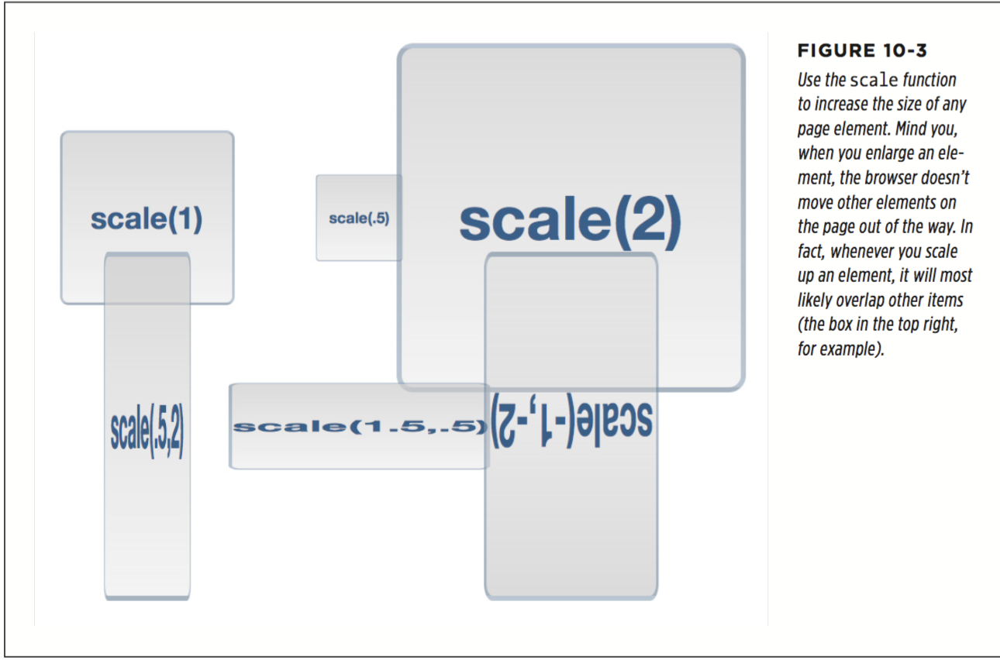

# chapter 10

* Transforms

The basic CSS property to achieve any of these changes is the CSS transform property. You use this property by supplying the type of transformation you want and a value indicating how much to transform the element. For example, to rotate an element, you supply the keyword rotate, followed by the number of degrees to turn it:
` transform: rotate(10deg);`
The above declaration rotates the element 10 degrees clockwise.

Browser support for transforms is very good: Internet Explorer 9, Safari, Chrome, Firefox, and Opera all support transforms. However, to get transforms to work in Safari and Internet Explorer 9, you need to add a vendor prefix, as shown in the first two lines of the following code (also see the box on the opposite page):
```
    -webkit-transform: rotate(10deg);
    -ms-transform: rotate(10deg);
    transform: rotate(10deg);
```

One strange feature of CSS transforms is that they don’t affect other elements around them. In other words, if you rotate an element 45 degrees, it may actually overlap elements above, below, or to the side. Web browsers actually start by setting aside the space the element would normally take up (before the transformation), and then they transform the element (rotate it, enlarge it, move it, or skew it). This process is readily apparent when you increase the size of an element by using a transform: scale function (page 332). If you increase an element’s size two times, the browser enlarges the transformed element but doesn’t move any of the surrounding content out of the way, usually causing parts of the page to overlap (Figure 10-1). In other words, the web browser preserves all the other parts of the page just as they would appear if the element wasn’t enlarged.

  

  * Rotate

  The transform property’s rotate function is easy to understand: You give it a degree value from 0 to 360, and the browser rotates that element the specified number of degrees around a circle (see Figure 10-2).

  CSS provides a mechanism for animating changes in CSS properties. So, for example, you can make a button spin around four times when a visitor mouses over it by starting with an initial rotation of 0deg and adding a :hover style for that button that has a rotation of 1440deg.

  


  * Scale

  You can also resize an element, making it bigger or smaller using the scale function (0 and 1 shrinks an element, while a number larger than 1 makes it bigger).
    `transform: scale(2);`

  The most common use for scale is to make a visual change to an element dynamically on the page. For example, mousing over a button may make that button momentarily bigger. You could achieve this e ect with the :hover state.
  ```
  .button {
      font: .9em Arial, Helvetica, sans-serif;
      border-radius: .5em;
      background-color: rgb(34,255,23);
      border: 1px solid rgba(0,0,0,.5);
      padding: .5em;
  }
  .button:hover {
      -webkit-transform: scale(1.2);
      -ms-transform: scale(1.2);
      transform: scale(1.2);
  }
  ```
  You can even scale the horizontal and vertical dimensions separately. To do this, supply two values separated by a comma inside the parentheses; the first number is the horizontal scale, and the second is the vertical scale. For example, to make an element half as wide but twice as tall, use this declaration:
  `transform: scale(.5,2);`

  CSS also provides separate functions for horizontal and vertical scaling: scaleX scales along the horizontal axis, while scaleY scales vertically. For example, to make an element twice as tall without changing its width, you’d write this:
  `transform: scaleY(2);`

  But to make an element three and a half times as wide, but not taller or shorter, you’d use:
  `transform: scaleX(3.5);`

  

  There’s another visual trick that scaling o ers: the ability to flip an element upside down and backwards. No one’s quite sure what branch of mathematics the W3C used to come up with this system, but if you use a negative number with scale, you actually flip an element around. For example, here’s how to flip an element upside down and left to right:
  `transform: scale(-1);`

  This produces the image pictured in Figure 10-4, left. You can also flip the element on only one axis. In the middle image in Figure 10-4, the image is flipped only on its horizontal axis. Flipping the element along its vertical axis produces the middle image:
  `transform: scale(-1,1);`

  It produces the e ect of a mirror held to the side of the element, or like you’ve flipped the element over and are looking through its back. What fun!

  

  * Translate

  The transform property’s translate function simply moves an element from its current position a set amount left or right and up or down. By itself, it’s really not that useful. As you read on page 320, when a web browser transforms an element, it doesn’t rearrange the page; it lays the page out as if the element had no trans- formation. Accordingly, when you move a div or other tag using the translate function, the browser leaves an empty space where the tag would normally appear, and then draws the element in its new position (see Figure 10-5). If you simply want to position an element on the page, you can use absolute or relative positioning, as described in Chapter 14.

  

  The translate function takes two values: The first specifies the horizontal movement, and the second the vertical movement. In this example, clicking an element with the .button class moves that element one pixel to the right and two pixels down. Use a negative number for the first value to move the element to the left; use a negative number for the second value to move the element up.

  ```
    .button:active {
      -webkit-translate(1px,2px);
      -ms-translate(1px,2px);
      translate(1px,2px);
    }
  ```
  You’re not limited to pixel values, either. Any valid CSS length value—px, em, %, and so on will work.
  CSS also provides two additional functions for moving an element just to the left or right—translateX—and up or down—translateY. `transform: translateY(-.5em);`

  * Skew

  Skewing an element lets you slant it on its horizontal and vertical axes; this can give an element a three-dimensional feel (see Figure 10-6). For example, to slant all the vertical lines so that they lean to the left 45 degrees (as in the first image in Figure 10-6), you’d write this code:
  `transform: skew(45deg, 0);`
  To do the same along the y-axis (middle image in Figure 10-6), you’d write this:
  `transform: skew(0,45deg);`
  You can skew an element on both axes at once. For example, here is the code used to produce the third image in Figure 10-6:
  ` transform: skew(25deg,10deg);`

  As with translate and scale, CSS o ers separate functions for the x- and y-axes: skewX and skewY

  

  * Multiple Transformations

  `transform: skew(45deg,0deg) scale(.5) translate(400px,500px) rotate(90deg);`

  The order in which you place the transform functions is the order in which the browser applies these effects.

  The order doesn’t really matter unless you’re using translate. Since translate actually moves the element, if you place it before a rotate, for example, the browser first moves the element and then rotates it. Since the element moved first, the point around which it rotates has changed. On the other hand, if you rotate it first, you’re then moving the rotated element a certain amount from its center (which is now in a new location).

  * Origin
  Normally, when you apply a transformation to an element, the web browser uses the center of the element as the transformation point. For example, when you rotate an element, the browser rotates it around its center point (Figure 10-7, left). However, CSS lets you change that transformation point, using the transform-origin property. It works just like the background-position property (page 236); you can supply keyword values, absolute values in pixels, and relative values in ems and percentages.

  For example, to rotate a div around its top-left point (Figure 10-7, middle),  you can use the left and top keywords, like this: `transform-origin: left top;` `transform-origin: 0 0;` `transform-origin: 0% 0%;`

  

* Transitions

While transforms can be fun (especially the rotate function), they really bring your page to life when coupled with a CSS transition. A transition is simply an animation from one set of CSS properties to another set over a specific amount of time. For example, you can make a banner rotate 360 degrees over the course of two seconds.

  * To make a transition work, you need a few things in place:

    * Two styles. One style represents the beginning look of the element—a red nav button, for example—while the second style is the ending look—a blue nav button. The web browser will take care of the process of animating the change between the two styles (changing the button from red to blue, for example).

    * The transition property.CSS adds the transition property—the secret sauce that makes the animation possible. In general, you apply the transition property to the original style, the style that defines the look of an element before the animation begins.

    * A trigger. The trigger is the action that causes the change between the two styles. With CSS, you can use several pseudo-classes to trigger an animation. The most common is the :hover pseudo-class. With it, you can animate the change between an element’s normal appearance and how it looks when a visitor mouses over it. You’ll see an example of that in just a minute. In addition, you have :active (when the mouse is clicked on an element), :target (when an element is the target of link), and :focus (when a link is tabbed to, or a form field is clicked into or tabbed to). Beyond that, you can use JavaScript to dynamically change the style of any tag (see the box on page 335).
    When the trigger no longer applies—when the visitor mouses o  a navigation button, for example—then the browser returns the tag to its previous style and animates the entire process. In other words, you only need to set a transition to an element once, and the browser takes care of animating from one style to another and back to the original style.

  A web browser can’t animate every single CSS property, but you still have a long list of properties to choose from. In addition to the rotate, scale, translate, and skew transformations you just read about, you can also animate color, background- color, border-color, border-width, font-size, height, width, letter-spacing, line-height, margin, opacity, padding, and word-spacing; the positioning properties—top, left, right, and bottom—which you’ll learn about in Chapter 15; and many other properties. You can find a complete list at www.w3.org/TR/css3- transitions/#animatable-properties.

  * Adding a Transition

  At the heart of CSS transitions are **four properties** that control **which properties to animate**, **how long the animation takes**, **the type of animation used**, and **an optional delay before the animation begins**. Here’s a simple example. Say you want a navigation button’s background color to change from orange to blue when a visitor mouses over it. First, you start with the two styles needed to switch between these two colors. For example, you can apply a class of .navButton to the link and then create two styles, like this:
  ```

     .navButton {
       background-color: orange;
     }
     .navButton:hover {
        background-color: blue;
     }
  ```
  These styles will work in any browser; hovering over the nav button will change its background from orange to blue. However, the change is instantaneous. To make the color animate over one second, add two new properties to the .navButton style, like this:
  ```
    .navButton {
      background-color: orange;
      transition-property: background-color;
      transition-duration: 1s;
    }
    .navButton:hover {
      background-color: blue;
    }
  ```
  The transition-property specifies which properties to animate. You can specify a single property (as in the above example), use the keyword all to animate all CSS properties that change, or use a comma-separated list to specify more than one (but not all) properties.

  It’s even possible to set separate timings for each animated property.
  ```
    transition-property: color, background-color, border-color;
    transition-duration: .25s, .75s, 2s;
  ```

  * Transition Timing

  To have a working, animated transition, you only need to set transition-property and transition-duration. However, you can control the rate of the animation by using the transition-timing-function property. This property can be a little con- fusing: It doesn’t control how long the animation takes (that’s what the transition- duration property is for). Instead it controls the speed during the animation. For example, you can begin the animation slowly and then quickly complete it, creating an effect where the background color changes almost imperceptibly at first, and then quickly completes its color change.

  The transition-timing-function property can take one of five keywords: linear, ease, ease-in, ease-out, and ease-in-out. If you don’t specify a timing function, the browser uses the ease method, which begins the animation slowly, speeds up in the middle, and slows down at the end, providing a more organic change.

  `transition-timing-function: ease-in-out;`

  * Delaying a Transition’s Start

  `transition-delay: .5s;`

  If you’re animating several properties, you may want to make one property wait until the others finish before its animation starts. For example, say you have a button whose background color and text color you want to change, and then have its border color change suddenly after the other two properties have finished. Here’s how you might do that:
  ```
    .navButton {
      color: black;
      background-color: #FF6603;
      border: 5px solid #660034;
      transition-property: color, background-color, border-color;
      transition-duration: 1s, 1s, .5s;
      transition-delay: 0, 0, 1s;
    }
    .navButton:hover {
      color: white;
      background-color: #660034;
      border-color: #FF6603;
    }
  ```

  * Transition Shorthand
  ```
    transition: all 1s ease-in .5s;
    transition: all 1s;
    transition: background-color 1s;

    transition: color 1s, background-color 1s, border-color .5s 1s;
    transition: color 1s,
                background-color 1s,
                border-color .5s 1s;
  ```

* Animations

CSS provides another, more feature-rich mechanism for creating animations. With CSS transitions, you can only animate from one set of CSS properties to another. CSS animations let you animate from one set of properties to another set to another set, and so on. In addition, you can have an animation repeat, pause when a visitor mouses over it, and even reverse itself once the animation reaches its end.

CSS animations are a bit more complicated than transitions, but they have the added benefit of not necessarily needing a trigger to begin the animation. While you can add an animation to a :hover state so the animation plays when the mouse hovers over an element, you can also have an animation start when the page loads. This effect lets you draw attention to a banner or logo by animating it across the page when a visitor first enters your site.

The first step in creating an animation is creating a set of keyframes. In animation, a keyframe is a single frame of an animation that dictates how the scene looks. Suppose the first keyframe shows a ball on one side of a soccer field. By adding a second keyframe, you can define an ending point for the animation—like the ball inside the goal on the other side of the soccer field. A web browser then provides the animation between the two keyframes by drawing all of the intermediate steps—the ball traveling across the field on its way to the goal.

If you’re thinking transitions use a similar idea, you’re right. In a transition, you define two styles and let the browser animate the change from one style to another. In this way, you could think of each of those styles as a keyframe. However, CSS animations let you define multiple keyframes, so you can create much more complex animated effects: a soccer ball traveling from one side of the field, to a player, to another player, and then into the goal, for example.

There are two steps in creating an animation:

**Define the animation**

    This involves setting up keyframes that list the CSS properties to animate.

**Apply the animation to an element**

    Once defined, you can apply the animation to any number of elements on a page. You can even set up separate timings, delays, and other animation properties for each element. So you can use the same animation with slightly di erent settings multiple times on a page.

  * Defining Keyframes

  ```
    @keyframes animationName {
      from {
        /* list CSS properties here */
      }
      to {
        /* list CSS properties here */
      }
    }
  ```

  You then add at least two keyframes. In the current example, the keywords from and to are used to create the beginning keyframe (from) and the final keyframe (to). Inside each keyframe you add one or more CSS properties—just as if you were creating a style. In fact, you can think of each keyframe as just a CSS style filled with one or more CSS properties. For example, say you want to create an animation that fades an element into view. You could start with an opacity value of 0 (invisible), and end with a value of 1 (fully visible):
  ```
     @keyframes fadeIn{
       from {
        opacity: 0;
       }
      to {
        opacity: 1;
      }
    }
  ```

  You’re not limited to just two keyframes, either. You can use percentage values to define multiple keyframes. The percentage represents where in the overall length of the animation the change should occur. For example, say you want to create an e ect where the background of an element changes from yellow to blue to red. You can write this:
  ```
    @keyframes backgroundGlow {
       from {
         background-color: yellow;
       }
       50% {
         background-color: blue;
       }
       to {
        background-color: red;
       }
     }
  ```

  Nor are you limited to a single CSS property. You can place any number of animatable properties (page 331) inside each keyframe—background-color, opacity, width, height, and so on:
 ```

      @keyframes growAndGlow {
        from {
          background-color: yellow;
        }
        50% {
          transform: scale(1.5);
          background-color: blue;
        }
        to {
          transform: scale(3);
          background-color: red;
        }
     }
 ```

 You can also get pretty tricky with the percentage values by adding multiple percent- age values for one set of CSS properties. This is useful in a couple of cases: First, it’s good if you want to animate to a certain point, pause, and then continue. For example, say you’d like to begin with a yellow background color for a <div> tag. Then you’d like to change that color to blue, stay at blue for a while, and then finish with a red color. In other words, you want a sort of pause in the middle while the background color stays constant before changing again. You can do that with this code:
 ```
  @keyframes glow {
      from {
        background-color: yellow;
      }
      25%, 75% {
        background-color: blue;
      }
      to {
        background-color: red;
      }
  }
 ```

 You can also use percentages when you want to use the same set of CSS proper- ties for di erent parts of the animation. For example, say you want to animate the background color again, but this time go from yellow to blue to orange to blue to orange to red. Blue and orange appear twice, so instead of writing their background- color properties multiple times, you can instead do this:
 ```
   @keyframes glow {
        from {
          background-color: yellow;
        }
        20%, 60% {
          background-color: blue;
        }
        40%, 80% {
          background-color: orange;
        }
        to {
          background-color: red;
        }
  }
 ```

 Unfortunately, as of this writing, to use CSS animations in Chrome, Safari, and Opera, you must also use the -webkit- vendor prefix.

  * Applying an Animation

  Once you’ve completed a set of keyframes, the animation is ready. However, to make it work, you need to apply it to an element on your page. You can add an animation to any style for any element on a page. If you simply add the animation to a style that applies immediately to an element—for example, an h1 tag style—the animation will apply when the page loads. You can use this technique to add an introductory animation to a page that makes a logo zoom into place in the page’s upper-left, or make a particular box of content glow to draw attention to it.

  In addition, you can apply an animation to one of the pseudo-classes, including :hover, :active, :target, or :focus to make an animation run when a visitor mouses over a link, for example, or clicks into a form field. Finally, you can apply the animation to a class style and use JavaScript to dynamically apply that class in response to a visitor clicking a button or some other page element (see the box on page 335).

  CSS provides a handful of animation-related properties to control how and when an animation plays back (as well as a shorthand version that encompasses all the individual properties). At a minimum, to get an animation running, you need to sup- ply the name you gave the original animation, and a duration for the animation.

  Here’s a simple example. Say you want a div with an important announcement to fade into view when the page loads. You’ve given that div a class name of announcement: <div class="announcement">.

  1. Create the fade-in animation with the `@keyframes rule`:

  ```
   @keyframes fadeIn {
      from { opacity: 0; }
      to { opacity: 1; }
  }
  ```

  2. Apply that animation to the style for the `<div>` tag:

  ```
  .announcement {
    animation-name: fadeIn;
    animation-duration: 1s;
  }
  ```
  The animation-name property simply tells the browser which animation to use. It’s the same name you provided when you created the animation in step 1. The animation-duration property sets the time the animation takes from start to finish. In this example, these are the only two animation properties listed, but you can (and probably will) put other non-animation properties in the style as well. For example, in the real world, you’d probably add properties such as width, background-color, border, and so on to this .announcement style.

  As with the `@keyframes` rule, each of the animation properties require the -webkit- vendor prefix to work in Chrome, Safari, and Opera, so the above .announcement style would need to be written like the following to work in as many browsers as possible:

  ```
  .announcement {
     -webkit-animation-name: fadeIn;
     -webkit-animation-duration: 1s;
     animation-name: fadeIn;
     animation-duration: 1s;
  }
  ```

  In addition, you can apply more than one animation to an element. Say you create one animation named fadeIn to make an element fade in and another animation named blink to make the background color blink wildly. To apply both animations to the element, you provide a comma-separated list of names like this:
  `animation-name: fadeIn, blink;`

  To give the animations separate timings, provide a list of comma-separated times:
  ```
    animation-name: fadeIn, blink;
    animation-duration: 1s, 3s;
  ```

  * Timing the Animation

  You can use the animation-timing-function to control the entire animation or just specific keyframes. For example, to apply the ease-out timing function for the fadeIn animation presented earlier (step 1 on page 342), add the timing function to the .announcement style (step 2 on page 345):
  ```
    .announcement {
      animation-name: fadeIn;
      animation-duration: 1s;
      animation-timing-function: ease-out;
    }
  ```

  However, you can also control the timing function for the animation between key- frames. For example, say you create an animation that has three keyframes with three di erent background colors. The web browser will animate from one color to another and then to a third. Perhaps you want it to slowly move from the first to the second color using a cubic Bezier curve, and then move in a uniform time from the middle to the end. You can do that by adding two timing functions, one to the first keyframe (which controls the animation from keyframe 1 to 2), and one at the second keyframe to control the animation from keyframe 2 to 3:
  ```

    @keyframes growAndGlow {
      from {
        background-color: yellow;
        animation-timing-function: cubic-bezier(1, .03, 1, .115);
      }
      50% {
        transform: scale(1.5);
        background-color: blue;
        animation-timing-function: linear;
      }
      to {
          transform: scale(3);
          background-color: red;
        }
      }
  ```
  You can also delay the beginning of the animation using the animation-delay prop- erty.

  ```
  .announcement {
      animation-name: fadeIn;
      animation-duration: 1s;
      animation-delay: 1s;
  }
  ```
  Adding a delay to an animation is a great way to catch people’s attention and add surprise to a page.

  * Finishing the Animation

  With CSS, you can control a few additional aspects of an animation, including whether to repeat an animation, which direction the animation runs if it’s animated more than once, and how the browser should format the element when the animation is complete.

  Transitions are animations that only run once—mouse over a button and the button grows, for example. Animations, however, can run once, twice, or continuously, thanks to the animation-iteration-count property. If you want an animation to run 10 times (fade in and out 10 times, perhaps), add this code to the style you’re animating:
  `animation-iteration-count: 10;`

  Normally a browser only plays the animation once, and if that’s all you’re after, then leave o  this iteration count property. If you want the animation to play continuously, the animation-iteration-count property accepts one keyword: infinite. So to run the fadeIn animation an infinite number of times on the announcement div, you can create this style:
  ```
    .announcement {
      animation-name: fadeIn;
      animation-duration: .25s;
      animation-iteration-count: infinite;
    }
  ```

  That, however, would annoy your visitors to no end, so please don’t do it. However, you could use a style like this for a simple “pulsing” effect where a “sign up today” button gently glows (by animating the box-shadow property discussed on page 201).

  Normally, when an animation runs more than once, a web browser literally starts the animation over from the beginning. So if you animated a background color from yellow to blue and repeated it twice, the browser would show a yellow box turning blue, and then suddenly the yellow box would return and then animate to blue once again. This e ect can be pretty jarring. In this case, it would look better if, for the second time through the animation, the browser simply reversed the e ect. That’s how transitions work. For example, when you mouse over an element, the browser animates the transition from the regular state to the rollover state. When you move the mouse o  the element, the browser simply reverses the animation to return to the regular state. To make an animation move forward on odd runs and backward on even runs, use the **animation-direction** property and the **alternate** keyword. For example, to make an element fade out and then back in again, you can create an animation called fadeOut, like this:
  ```
  @keyframes fadeOut {
       from { opacity: 1; }
       to { opacity: 0; }
  }
  ```
  Then, play that animation twice, reversing its direction on the second time:
  ```
    .fade {
      animation-name: fadeOut;
      animation-duration: 2s;
      animation-iteration-count: 2;
      animation-direction: alternate;
    }
  ```

  This code tells the web browser to run the fadeOut animation on any element with the class of fade. The animation should run for two seconds and then repeat. Be- cause of the alternate value for animation-direction, the animation will fade out the first time (go from totally opaque—an opacity of 1—to invisible—an opacity of 0), but will run backwards the second time (from 0 to 1 opacity), which makes it fade back into view.

  No matter how many times you have a web browser run an animation, once the animation is completed, the browser displays the animated element in its original, pre-animation state. For example, say you animate an image so it slowly grows to twice its size. Once the animation is completed, the web browser snaps the image back down to its original size, creating a jarring visual effect. Fortunately, you can tell the browser to keep the animated element formatted the same as when the animation ended by setting the **animation-fill-mode** property to **forwards**.
  `animation-fill-mode: forwards;`

  * Animation Shorthand

  ```
    .fade {
       animation-name: fadeOut;
       animation-duration: 2s;
       animation-timing-function: ease-in-out;
       animation-delay: 5s;
       animation-iteration-count: 2;
       animation-direction: alternate;
       animation-fill-mode: forwards;
    }

    .fade {
      animation: fadeOut 2s ease-in-out 5s 2 alternate forwards;
    }
  ```

  That’s one line of code instead of seven! You should list the property values in the order used above: name, duration, timing function, count, direction, delay, and fill- mode. In addition, make sure each value is separated by a space. Only the name and duration are actually required. The other values are optional.

  If you want to apply more than one animation to an element, simply use comma- separated lists of animation properties. For example, to apply two animations (say fadeOut and glow) to the .fade style, write this:
  ```
    .fade {
      animation: fadeOut 2s ease-in-out 5s 2 alternate forwards,
      glow 5s;
    }
  ```

  Of course, in real usage you’d need to use the -webkit- vendor prefix as well:
  ```
    .fade {
      -webkit-animation: fadeOut 2s ease-in-out 5s 2 alternate forwards,
                          glow 5s;
      animation: fadeOut 2s ease-in-out 5s 2 alternate forwards,
                 glow 5s;
    }
  ```

  * Pausing an Animation

  CSS includes another animation **property—animation-play-state—to** control an animation’s playback. It accepts only one of two keywords: **running or paused**. To pause an animation, simply apply this declaration to a style:
  `animation-play-state: paused;`

  There’s only one way to really apply that using CSS, however—a pseudo-class. As with transitions, you need some kind of trigger to pause an animation. One way to do this is to pause any animation when a visitor mouses over the animation. Here’s an example using the .fade class style:
  ```
    .fade {
      animation: fadeOut 2s ease-in-out 2 alternate 5s forwards,
                glow 5s;
    }
  ```

  This code runs two animations—fadeOut and glow—on any element with the fade class applied to it. Say you want to let visitors pause this animation simply by mous- ing over it. You’d only need to add one more style:
  ```
    .fade:hover {
      animation-play-state: paused;
    }
  ```
  Of course, you’ll need all the -webkit- vendor prefixed version as well: -webkit- animation-play-state.

  A more powerful way to pause an animation would be to dynamically apply the animation-play-state property to the element using JavaScript. In this way, you can create a complex animation and add a Pause button that pauses the animation when clicked.


https://css-tricks.com/controlling-css-animations-transitions-javascript/
