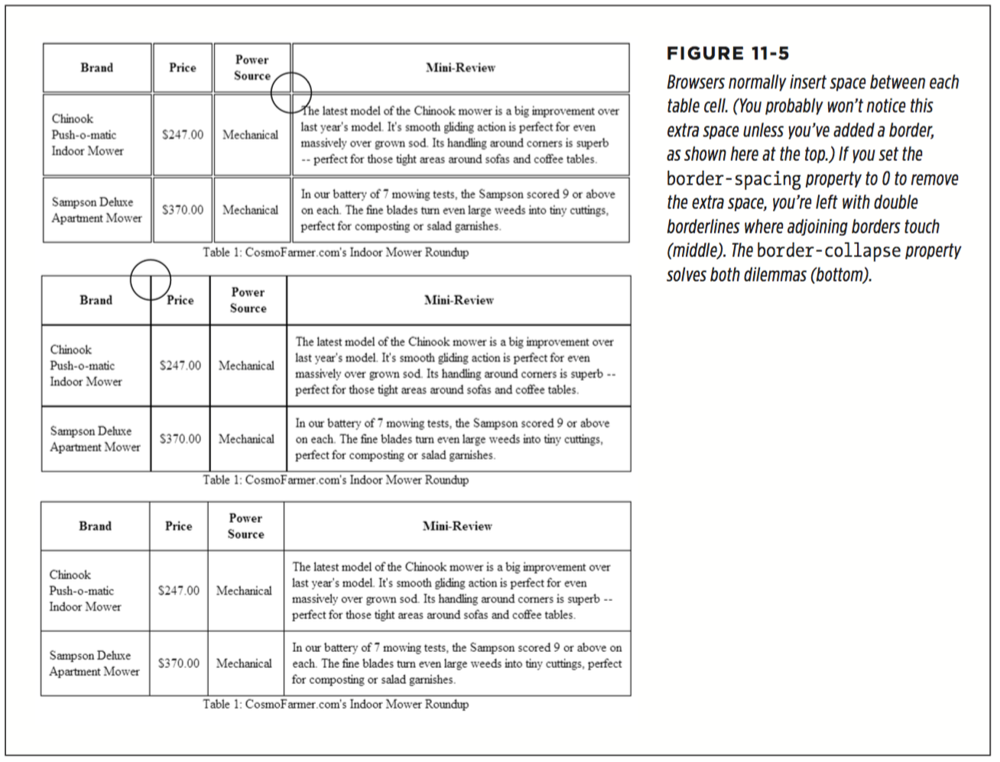

# chapter 11: Formatting Tables and Forms

* Using Tables the Right Way

```
<table>
    <caption align="bottom">
      Table 1: CosmoFarmer.com's Indoor Mower Roundup
    </caption>
    <colgroup>
      <col class="brand" />
      <col class="price" />
      <col class="power" />
    </colgroup>
    <thead>
      <tr>
        <th scope="col">Brand</th>
        <th scope="col">Price</th>
        <th scope="col">Power Source</th>
      </tr>
    </thead>
    <tbody>
      <tr>
        <td>Chinook Push-o-matic Indoor Mower</td>
        <td>$247.00</td>
        <td>Mechanical</td>
      </tr>
      <tr>
        <td>Sampson Deluxe Apartment Mower</td>
        <td>$370.00</td>
        <td>Mechanical</td>
      </tr>
    </tbody>
</table>
```

Even with only three rows and three columns, the table uses nine unique HTML tags: `<table>, <caption>, <colgroup>, <col>, <thead>, <tbody>, <tr>, <th>, and <td>`. In general, more HTML isn’t a good thing, and you don’t need all of these tags: You can get away with just the `<table>, <tr>, and <td>` tags (and usually `<th>` as well). However, a table’s various tags give you lots of useful hooks to hang CSS styles on. The headers of each column—the `<th>` tags—can look different from other table cells if you create a `<th>` tag style, and you can use the `<colgroup>` tag as an easy way to set the width of a table column. This saves you the hassle of having to create lots of classes—like .tableHeader—and then apply them by hand to individual table cells. In the next section, you’ll see examples of how you can use these different tags to your advantage.

  

* Styling Tables

Because tables are composed of several HTML tags, it helps to know which tag to apply a particular CSS property to. Applying padding to a `<table>` tag, for example, has no effect. The next few sections cover CSS properties for formatting tables and which HTML tags they get along with.

  * Adding Padding

  When it comes to tables, the borders are the edges of a cell, so padding adds space around any content you’ve placed inside of a table cell.

  You apply padding to either a table header or a table cell tag, but not to the `<table>` tag itself. So, to add 10 pixels of space to the inside of all table cells, use this style:
  ```
     td, th { padding: 10px; }

     td {
        padding-top: 10px;
        padding-right: 5px;
        padding-bottom: 3px;
        padding-left: 5px;
      }

      td {
        padding: 10px 5px 3px 5px;
      }
  ```

  * Adjusting Vertical and Horizontal Alignment

  To control where content is positioned within a table cell, use the `text-align` and `vertical-align` properties.

  Text-align controls horizontal positioning and can be set to left, right, center, and justify (see Figure 11-3). It’s an inherited property. (See Chapter 4 for more on inheritance.) When you want to right-align the contents of all table cells, create a style like this: ` table { text-align: right; }`

  This property comes in handy with `<th>` tags, since browsers usually center-align them. A simple style like `th { text-align: left; }` makes table headers align with table cells.

  

  Table cells have a height as well. Web browsers normally align content vertically in the middle of a table cell (see the middle example in Figure 11-4). You can control this behavior by using the vertical-align property. Use one of these four values: top, baseline, middle, or bottom.

  Unlike text-align, the vertical-align property isn’t inherited, so you can use it only on styles that apply directly to `<th>` and `<td>` tags.

  

  * Creating Borders

  The CSS border property (page 194) works pretty much the same with tables as with other elements, but you need to keep a couple of things in mind. First, apply- ing a border to a style that formats the `<table>` tag outlines just the table, not any of the individual cells. Second, applying borders to cells—`td { border: 1px solid black; }`—leaves you with a visual gap between cells, as shown in Figure 11-5, top. To gain control of how borders appear, you need to understand how web browsers normally draw table cells and the CSS `border-collapse` property.

    * Controlling the space between table cells

    Unless instructed otherwise,browsers separate table cells by a couple of pixels. This gap is really noticeable when you apply a border to table cells. CSS gives you the border-spacing property to control this space. Apply this property to the table itself, and if you wish to remove the space that browsers normally place between cells, then set the border-spacing property to 0 (Of course, if you like space between the cells, then add space:):
    ```
      table {
        border-spacing: 0;
      }

      table {
        border-spacing: 2px;
      }
    ```

    * Eliminating double borders

    Even if you eliminate the cell spacing of a table, borders applied to table cells double up. That is, the bottom border of one cell adds to the top border of the underhanging cell, creating a line that’s twice as thick as the border setting (Figure 11-5, middle). The best way to eliminate this (and eliminate cell spacing at the same time) is to use the `border-collapse` property. It accepts two values: separate and collapse. The separate option is normally how tables are displayed, with the cell spaces and doubled borders. Collapsing a table’s borders eliminates the gaps and doubled borders (Figure 11-5, bottom). Apply the collapse value to a style formatting a table, like so: `table { border-collapse: collapse; }`

    * Rounded corners

    You can use the `border-radius` property(page199) to add rounded corners to table cells (but not to tables themselves). For example, if you want to outline table cells and give them rounded corners, you can create this style:

    ```
      td {
          border: 1px solid black;
          border-radius: 5px;
      }
    ```

    Note that if you set the border-collapse property to collapse, then browsers ignore any border-radius you’ve set for table cells; they’ll just draw regular square corners.

  


  * Styling Rows and Columns

    * Styling Rows:
    ```
    tr:nth-of-type(odd) { background-color: red; }
    tr:nth-of-type(even) { background-color: blue; }

    .products tr:nth-of-type(odd) { background-color: red; }
    .products tr:nth-of-type(even) { background-color: blue; }
    ```
    You’re not limited to colors either. You can use background images (see page 231) or even linear gradients (page 252) to create more sophisticated looks like the slight gradation in the table header row of Figure 11-6.

    * Styling Columns

    Formatting columns is a bit trickier. HTML provides the `<colgroup>` and `<col>` tags to indicate groups of columns and individual columns, respectively. You include one `<col>` tag for each column in the table and can identify them with either a class or ID.

    Only two sets of properties work on these tags: width and the background properties (background-color, background-image, and so on). But they can come in mighty handy. When you want to set the width of all of the cells in a column, you can skip any HTML attributes and just style the column, using a style applied to the `<col>` tag. For example, say you have this bit of `HTML: <col class="price">`. You can add this style to a style sheet to set the width of each cell in that column to 200 pixels: `.price { width: 200px; }`

    To highlight a column, you can use the background properties. Again, assume you have a <col> tag with a class of price applied to it: `.price { background-color: #F33; }`

    Keep in mind, however, that backgrounds for columns appear under table cells, so if you set a background color or image for `<td>` or `<th>` tags, the column’s background won’t be visible.
