# chapter 13 : Building Float- Based Layouts

  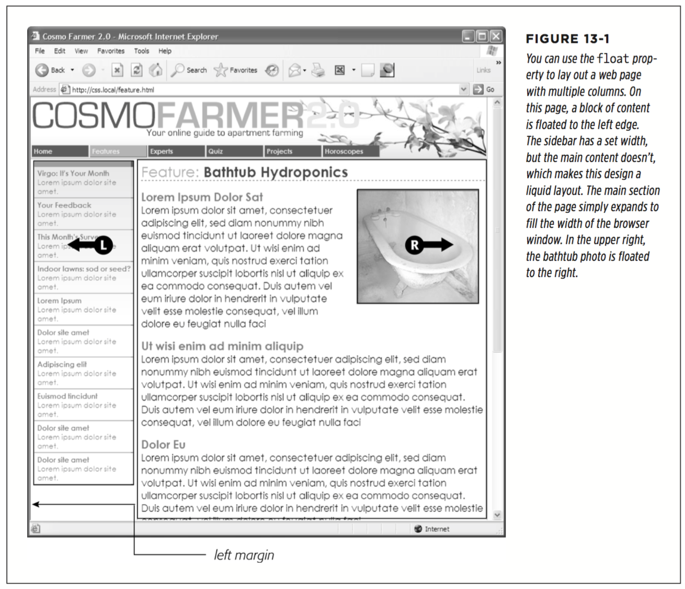

A simple two-column design like Figure 13-1 requires just a few steps:

1. Wrap each column in a `<div>` tag with an ID or class attribute

In Figure 13-1, the news items listed in the left sidebar are wrapped in one div— `<div class="news">` — and the main content in another div — `<div class="main">`.

2. Float the sidebar div either right or left

  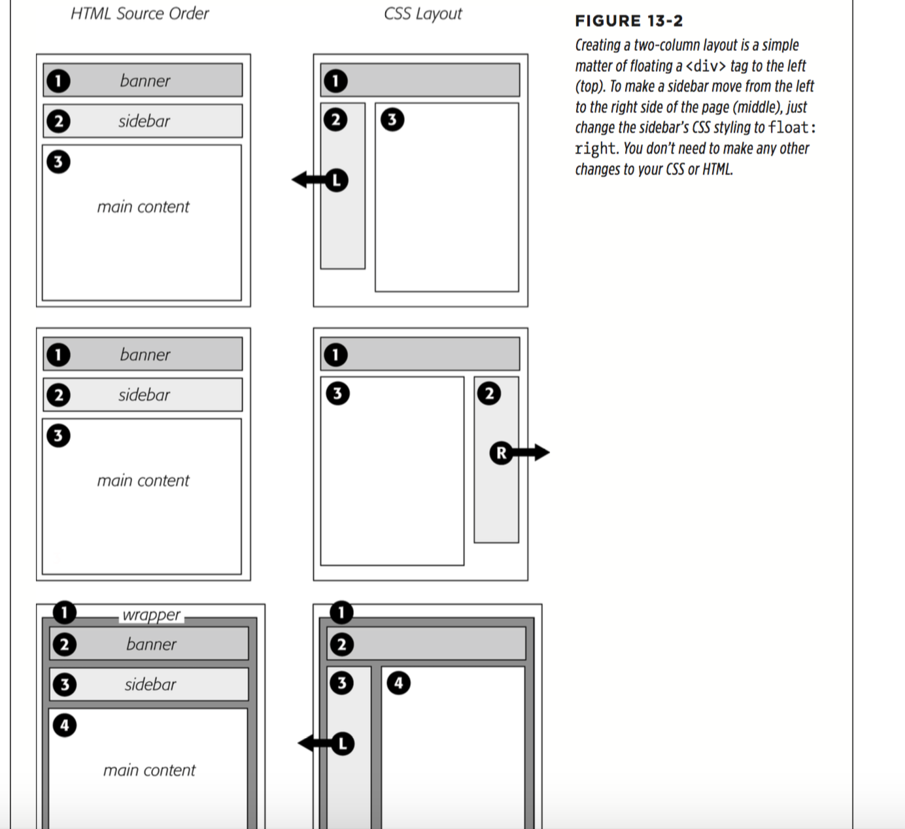

3. Set a width for the floated sidebar `.news { width: 25%}`

4. Add a left margin to the main content `.main { margin-left: 27%; }`

* Applying Floats to Your Layouts

Now that you’ve learned a basic two-column liquid layout, you can adapt it in countless ways. Converting it to a fixed-width layout is a snap. Simply wrap all the tags within the page’s body inside another `<div>` (like `<div class="wrapper">`). Then create a style for that new container element that has a set width, such as 960 pixels (see Figure 13-2, bottom). That width setting constrains everything inside the container box.

Expanding it into a three-column design isn’t diffcult, either (Figure 13-3). First, add another `<div>` between the two columns and float it to the right. Then add a right margin to the middle column, so that if the text in the middle column runs longer than the new right sidebar, it won’t wrap underneath the sidebar.

  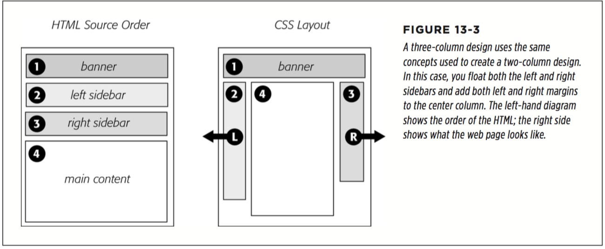

  * Floating All Columns

  It’s perfectly possible to float every column, not just the left and right sidebars. You could float the first sidebar to the left, the middle column to the left, and the right sidebar to the right, as shown in Figure 13-4, top. This approach lets you put more than three columns in your design. You can float four or more columns, as long as there’s room for all the floats to fit side by side.

  When you float all columns in a design, you need to pay close attention to the widths of each column. If the total width of all the columns is more than the space available—for example, if the browser window is smaller or the columns are placed inside another `<div>` with a set width—then the last column drops down below the others.

  * Floats Within Floats

  The bottom diagram in Figure 13-4 illustrates another useful technique—floating elements within floats. Imagine that the main content (3) and the left sidebar (4) divs didn’t exist, and only the column wrapper (2) and the right sidebar (5) were left. You’d have just a basic two-column design, with one column floated left and another floated right. In fact, it’s still a two-column design even with the two divs (3 and 4) placed back inside the column-wrapper div. The difference is that the left column is itself divided into two columns.

  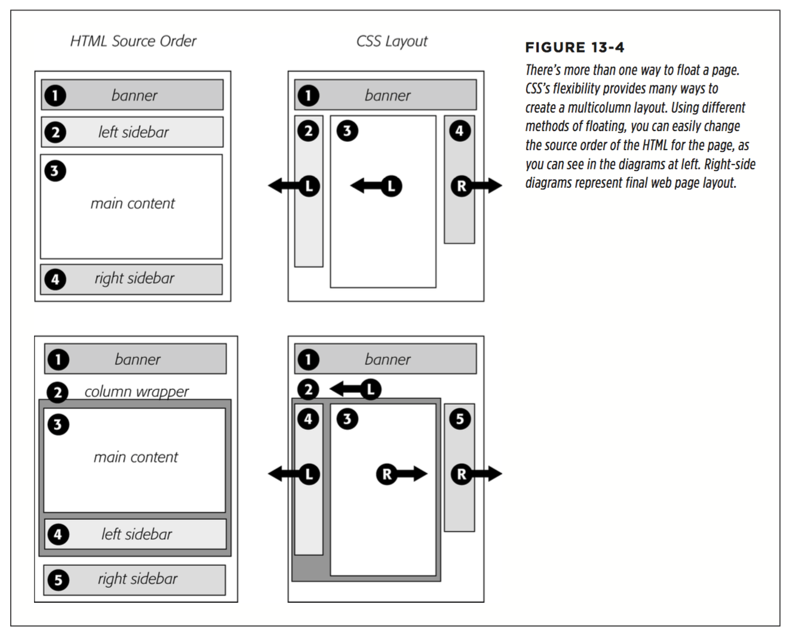

* Overcoming Float Problems

  * Clearing and Containing Floats

  Floats are powerful design tools because they let content flow around them. Floating a photo lets text below it move up and wrap around the image (Figure 13-1). When you’re creating float-based column designs, though, sometimes you don’t want content to move up and next to a floated element. For example, you frequently want to keep copyright notices, contact information, or other housekeeping details at the bottom of your web page, below all other content.

  In the two- and three-column designs you’ve seen so far, if the main column is shorter than either of the floated sidebar columns, a footer can move up and around the left floated column (Figure 13-6, left). To make the footer stay down below the sidebars, you can use the clear property. This property prevents an element from wrapping around floats. You can make an element drop below a left-floated object (clear: left;) or a right-floated object (clear: right;). For footers and other items that need to appear at the bottom of the page, you should clear both left and right floats, like this: `footer { clear: both; }`

  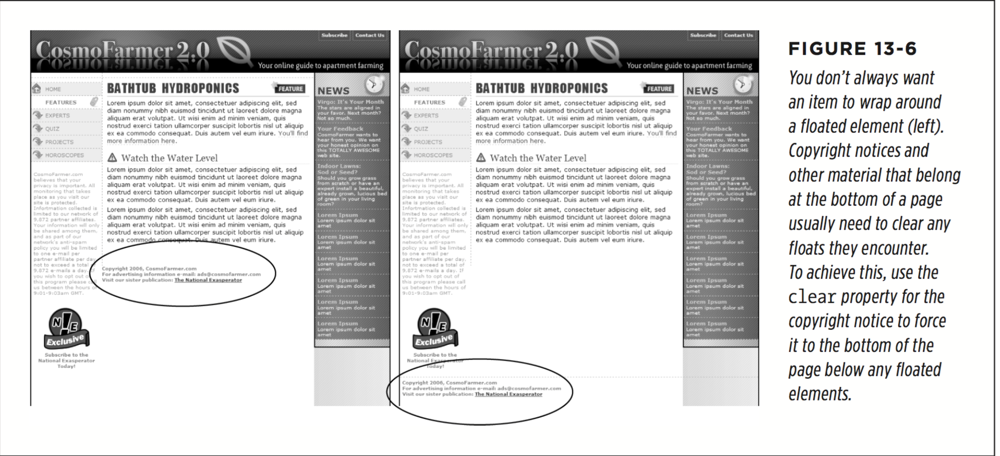

  Another problem occurs when you float one or more elements inside a non-floated containing tag like a `<div>` tag. When the floated element is taller than the other content inside the div, it sticks out of the bottom of the enclosing element. This snafu is especially noticeable if that tag has a background or border. The top of the web page in Figure 13-7 shows a `<div>` tag that has an` <h1> `tag and two columns
  created by floating two divs. The background and border, which appear only around the `<h1>` tag, are actually applied to the entire enclosing `<div>`, including the area where the two columns are. However, since the columns are floated, they pop out of the bottom instead of expanding the borders of the box.

  A similar problem happens in the bottom example in Figure 13-7. In this case, each image is floated left inside a containing `<div>` that has a border. Because the images are taller than their boxes, they pop out of the bottom. Unfortunately, this example is even worse than the previous one, because each image causes the image below it to wrap to the right, creating an ugly staggered effect.

  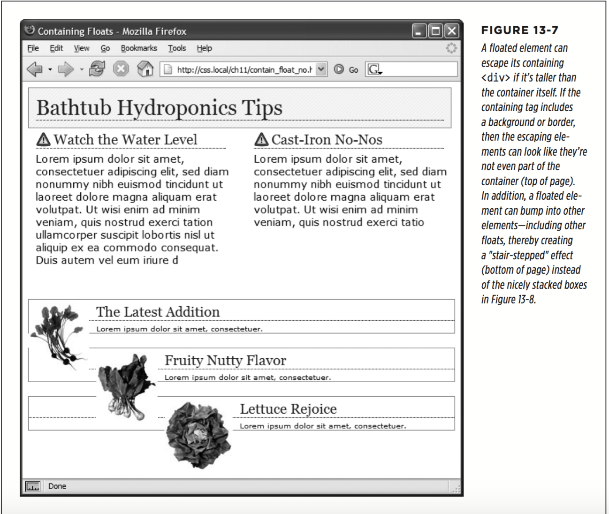

  You have many ways to tackle the problem of these renegade floating elements. It’s good to have more than one solution at your fingertips, so here’s a list of the most popular:

    * Add a clearing element at the bottom of the containing div

    This solution is the most straightforward. Simply add a tag—like a line break or horizontal rule—as the last item in the `<div>` containing the floated element (that is, right before the closing `</div>` tag). Then use the clear property to force that extra tag below the float. This trick makes the enclosing div expand, revealing its background and border. You can add a line break—`<br>` (HTML) or `<br />` (XHTML)—before the closing `</div>` tag and add a class to it: `<br class="clear"/>`. Then create a style for it, like this: ` br.clear { clear: both; }`

    The problem with this technique is that it adds extra HTML.

    * Float the containing element

    An easier way is to just float the `<div>` containing the floated elements as well. A floated container <div> expands to fully contain any floated elements inside it. In Figure 13-8, top, the <div> containing the heading and two floated columns is floated to the left of the page. In the process, its entire box—background and borders—expands to fit everything inside it, including the floated elements. Strange, but true.

    If you go this route, make sure you add a clear property to whatever element follows the floated container to make sure the following element drops below the container.

    * Use overflow:hidden

    Another common technique is to add the following two properties to a style for the containing block:`overflow: hidden;`

    The `overflow:hidden` property is just another one of those weird CSS things: It forces the containing block to expand and contain the floated elements. In general, this technique works very well. However, if you have any absolutely positioned elements (see page 430) inside the container, they may not show up. You can get into this situation if you have a drop-down menu inside another tag and the drop-downs, when they appear, are supposed to appear outside the container element. If that’s the case, use one of the other methods described on these pages.

    * Use the Micro Clear Fix

    With this technique,created by Nicolas Gallagher,you add just a few styles and a class name to the tag containing the floated element. This technique is the latest in a long evolution of methods that use the :after pseudo-class. To use it, add the following style to your style sheet:
    ```
    .clear:after {
      content: " ";
      display: table;
      clear: both;
    }
    ```

    Once you’ve added that style to a style sheet, you simply add the class name to the div containing the escaping floats: `<div class="clear">`. If you’re using HTML5 sectioning elements like `<article>` or `<footer>`, then add that class to them: `<article class="clear">`. (See the bottom of Figure 13-8.) This technique is very reliable; however, unlike the previous two techniques, you do have to add extra HTML (the class attribute) to the page.

    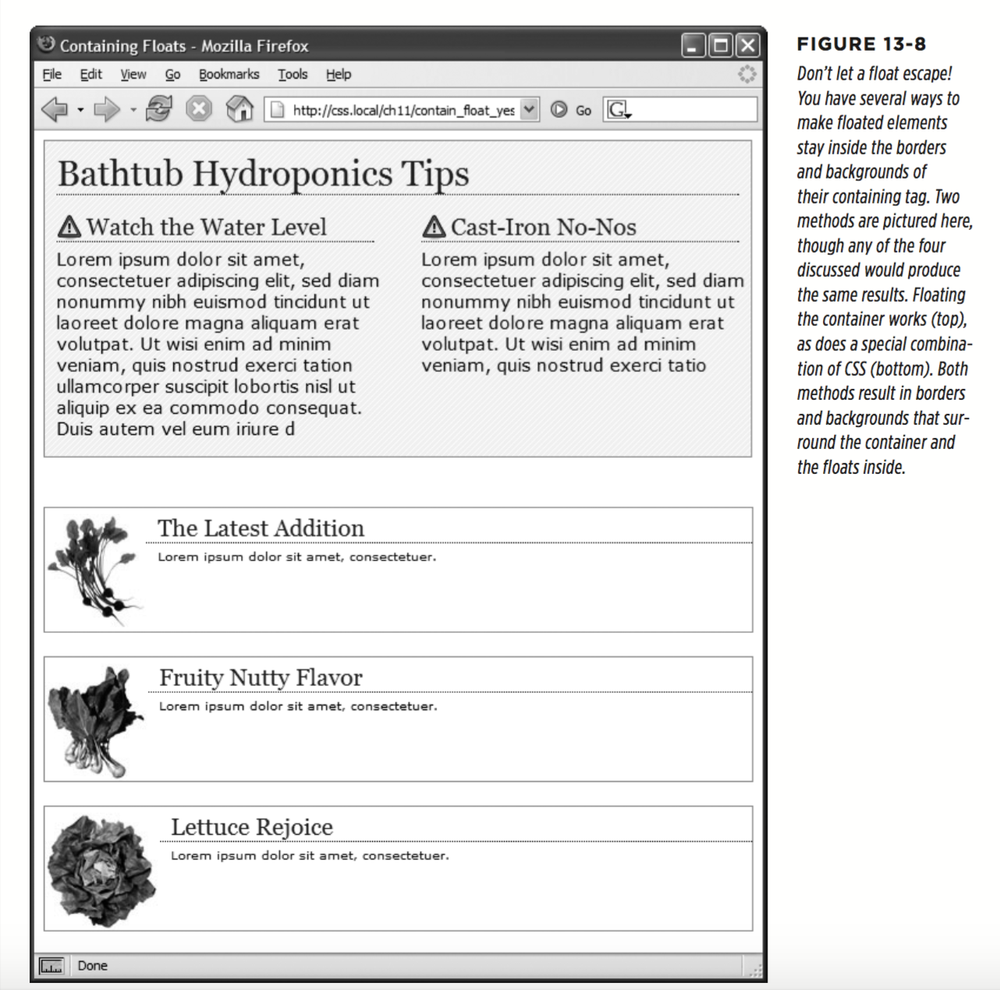

  * Creating Full-Height Columns

  HTML tables aren’t great for web page layout for several reasons. They add lots of code, they’re di cult to update, and they don’t work well on alternative browsers like those used by cellphones. But tables have one thing going for them in the layout department—the ability to create columns of equal height. Equal-height columns let you add a background color or graphic to one column and have it fill the entire height of the page. The backgrounds of the two sidebars in the top image of Figure 13-9 fill the screen height, creating solid, bold stripes on either side of the page.

  CSS floats, on the other hand, fall a bit short in this regard. Table cells in a row are always the same height, which isn’t true of divs. The height of a float is usually dictated by the content inside it; when there’s not a lot of content, the float is not very tall. Since a background image or background color fills only the float, you can end up with solid-colored columns that stop short of the page bottom, as in the circled areas at the bottom of Figure 13-9.

  As with most problems related to CSS, there are several workarounds. The most tried-and-true method is the faux column technique first championed by CSS guru Dan Cederholm. The secret is to add background images to a tag that wraps around the stubby sidebar and the other columns on the page. Say your HTML has two `<div>` tags that contain the content for a left sidebar and the page’s main content:
  ```
    <div class="sidebar">Sidebar content here</div>
    <div class="main">Main content for page, this column has a lot of text and is much taller than the sidebar.</div>
  ```

  The sidebar <div> is floated to the left edge of the page and has a width of 170 pixels. Because there’s less content in the sidebar, it’s shorter than the main text. Suppose you wrap that HTML in a wrapper <div> tag, like so:
  ```
    <div class="wrapper">
      <div class="sidebar">Sidebar content here</div>
      <div class="main">Main content for page, this column has a lot of text and is much taller than the sidebar.</div>
    </div>
  ```

  That outer div grows to be as tall as the tallest element inside it, so if the main div is very tall, that wrapper div will be just as tall. Here’s the magic: Create a style for the wrapper div with a background image the width of the sidebar, in the background color you want for the sidebar. That way, if the background image tiles vertically, it forms a solid bar the height of the wrapper div (Figure 13-9, top).
  `.wrapper { background: url(images/col_bg.gif) repeat-y left top; }`
  Web browsers display that background image directly under the sidebar, creating the illusion that the sidebar has a background color.

  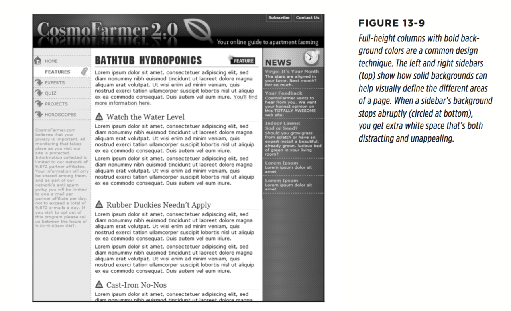
  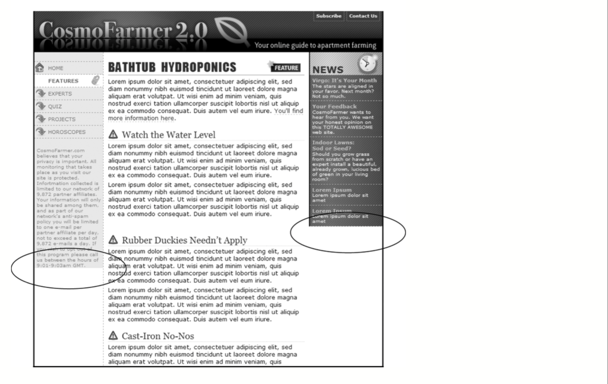

  Reproducing this result for two columns is just a little more involved. First, add two wrapper divs (the reason is you can only apply one background-color to one div):
  ```
  <div class="wrapper1">
    <div class="wrapper2">
      <div class="sidebar1">Sidebar content here</div>
      <div class="sidebar2">Second sidebar</div>
      <div class="main">Main content for page, this column has a lot of text and is much taller than the two sidebars.</div>
    </div>
  </div>
  ```

  If the first sidebar appears on the left side of the page and the second sidebar appears on the right side, create two styles. Apply one style to the first wrapper `<div>` tag to add a background to the left sidebar; apply one to the second wrapper `<div>` to add a background to the right sidebar (Figure 13-10, bottom).
  ```
  .wrapper1 { background: url(images/col1_bg.gif) repeat-y left top; }
  .wrapper2 { background: url(images/col2_bg.gif) repeat-y right top; }
  ```

  When adding a background image to the right-hand column, make sure you posi- tion the background image in the top right of the second wrapper, so that it falls underneath the second sidebar on the right side of the page.

  One major problem with the faux-column technique is that it’s very diffcult to make it work when the columns are all percentage widths. If the widths of the sidebars are a percentage of the browser window, they can be thinner or wider depending upon a visitor’s monitor. The faux-column technique requires placing a graphic in the background of the wrapper element. That graphic is a specific width and won’t scale as the browser’s width, and thus the column’s width, changes.

  One clever workaround uses linear gradients (page 252) to add a gradient to a wrap- per element. The gradient becomes the background colors for the columns inside the wrapper element. Now, you may be thinking, "I like rainbows and all, but I want the background colors to each column to be solid, not a gradient that morphs from one color to the next." Well, fear not, you can get solid colors.

  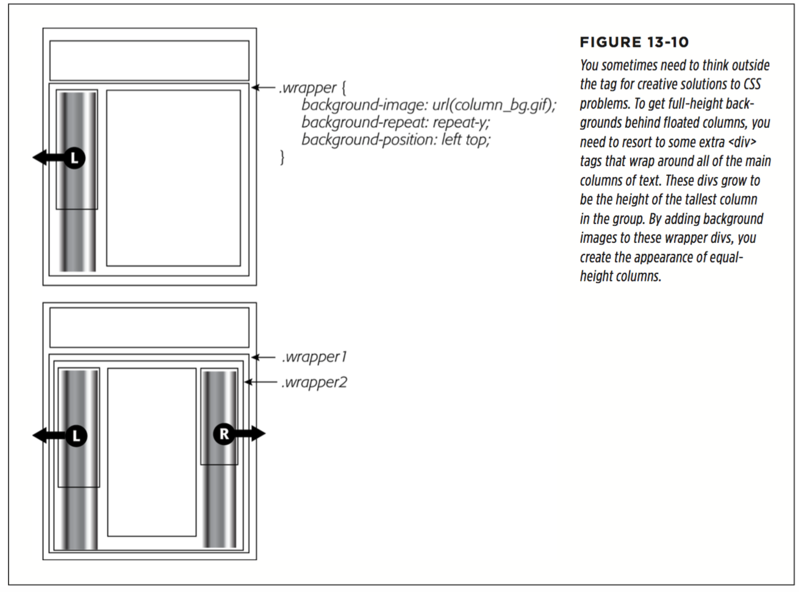

  As described on page 254, linear gradients let you set color stops—places where a new color is defined as part of the gradient. If the first stop is white, for instance, and the second stop is white, the gradient runs from white to white. In other words, there’s no color change—it’s just one solid color. In addition, you can set a color stop at the same spot as another color stop, which lets the second color begin immediately after the other with no subtle gradient effect.

  Say you have a three-column design. The first column is 25 percent wide, the middle column is 50 percent wide, and the third column is 25 percent wide. You want the first column to have a background color of red, the middle white, and the third blue.

  1. Wrap all three columns in a wrapping element:
  ```
  <div class="wrapper">
    <div class="sidebar1"> ... content here ...</div>
    <div class="main"> ... content here ...</div>
    <div class="sidebar2"> ... content here ...</div>
  </div>
  ```

  2. Add a linear gradient,with color stops that match the width of the columns
  ```
  .wrapper {
    background-image: linear-gradient(left,
      red 0%,
      red 25%,
      white 25%,
      white 75%,
      blue 75%,
      blue 100%);
  }
  ```

  * Preventing Float Drops

  Suddenly, one of your columns simply drops down below the others (Figure 13-11, top). It looks like there’s plenty of room for all the columns to coexist perfectly side by side, but they don’t. You’ve got the dreaded float drop.

  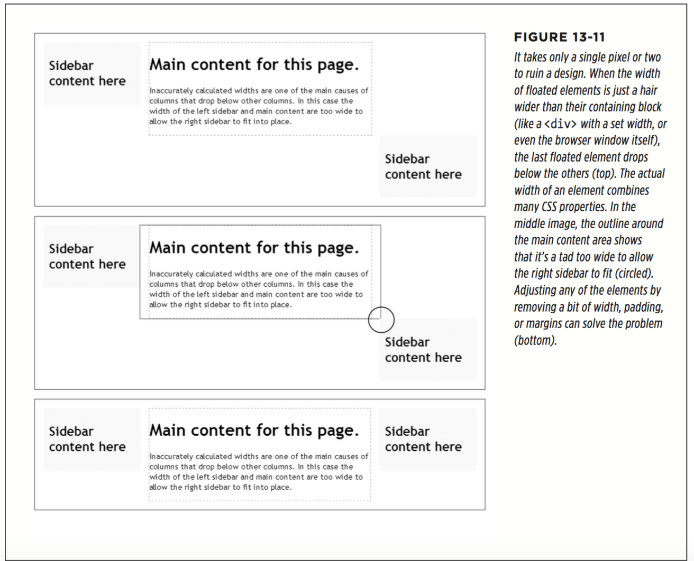

  * Preventing Float Drops With Box-Sizing

  The main culprit responsible for float drops is the wacky way browsers calculate the actual screen width for an element. You set the width to 100 pixels, for example, but the browser draws it as 122 pixels, because you’ve also added 10 pixels of left and right padding and a 1-pixel border around the whole thing. Fortunately, one CSS property lets you sidestep these headache-inducing calculations.

  The CSS box-sizing property lets you tell a web browser to use a different model for calculating the actual screen width of an element. You can give it one of three values:
  ```
    box-sizing: content-box;
    box-sizing: padding-box;
    box-sizing: border-box; (this is probably you want to use)

    * {
    box-sizing: border-box;
    }
  ```
