# chapter 14 : Positioning Elements on a Web Page

* How Positioning Properties Work

CSS offers four types of positioning:

  * Absolute

  Absolute positioning lets you determine an element’s location by specifying a left, right, top, or bottom position in pixels, ems, or percentages. You can place a box 20 pixels from the top and 200 pixels from the left edge of the page, as shown in Figure 14-1, middle.

  In addition, absolutely positioned elements are completely detached from the flow of the page as determined by the HTML code. In other words, other items on the page don’t even know the absolutely positioned element exists. They can even disappear completely underneath absolutely positioned items, if you’re not careful.

  **Don’t try to apply both the float property and any type of positioning other than static(explained below) or relative to the same style. The float property and absolute or fixed positioning can’t work together on the same element.**

  * Relative

  A relatively positioned element is placed relative to its current position in the HTML flow. So, for example, setting a top value of 20 pixels and left value of 200 pixels on a relatively positioned headline moves that headline 20 pixels down and 200 pixels from the left **from wherever it would normally appear.**

  Unlike with absolute positioning, other page elements accommodate the old HTML placement of a relatively positioned element. Accordingly, moving an element with relative positioning leaves a “hole” where the element would have been. Look at the dark strip in the bottom image of Figure 14-1. That strip is where the relatively positioned box **would have** appeared, before it was given orders to move. The main benefit of relative positioning isn’t to move an element, but to set a new point of reference for absolutely positioned elements that are nested inside it. (More on that brain-bending concept on page 435.)

  * Fixed

  A fixed element is locked into place on the screen.It does the same thing as the fixed value for the background-attachment property (page 242). When a visitor scrolls the page, fixed elements remain onscreen as paragraphs and headlines, while photos disappear o  the top of the browser window.

  Fixed elements are a great way to create a fixed sidebar or lock a navigation bar to the top or bottom of the browser window. You can read about how to create this effect on page 446.

  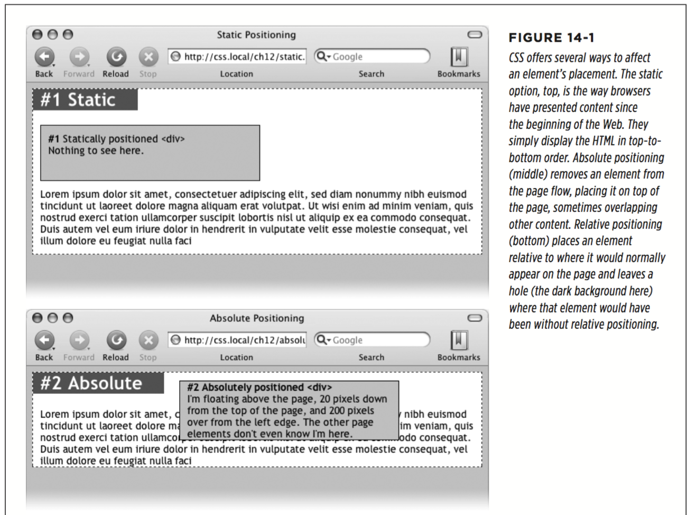
  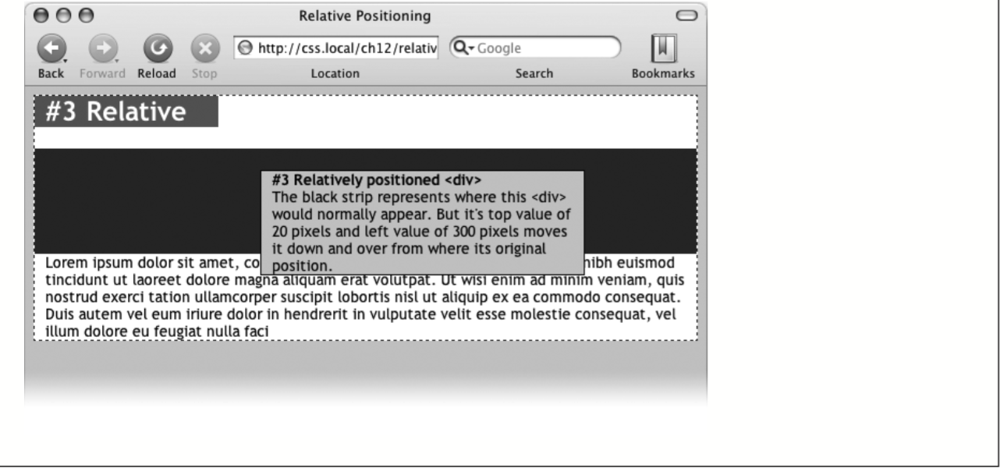

  * Static

  Static positioning simply means the content follows the normal top-down flow of HTML (see Figure 14-1, top). Why would you want to assign an element static positioning? The short answer: You probably never will.


To change the positioning of any element, simply use the position property fol- lowed by one of the four keywords: absolute, relative, fixed, static. To create an absolutely positioned element, add this property to a style:`position: absolute;`

Static is the normal positioning method, so unless you’re overriding a previously created style that already has a position of absolute, relative, or fixed, you won’t need to specify that. **In addition, static elements don’t obey any of the positioning values discussed next.**

  * Setting Positioning Values

  The display area of a web browser window—also called the viewport—has top, bottom, left, and right edges. Each of the four edges has a corresponding CSS property: top, bottom, left, and right. But you don’t need to specify values for all four edges. Two are usually enough to place an item on the page. You can, if you want, place an element 10 ems from the left edge of the page and 20 ems from the top.

  To specify the distance from an edge of a page to the corresponding edge of the element, use any of the valid CSS measurements—pixels, ems, percentages, and so on. You can also use negative values for positioning, like left: –10px; to move an element partly o  the page (or o  another element) for visual effect, as you’ll see later in this chapter (page 444).

  After the position property, you list one or more properties (top, bottom, left, or right). If you want the element to take up less than the available width (to make a thin sidebar, for example), then you can set the width property. To place a page’s banner in an exact position from the top and left edges of the browser window, create a style like this:
  ```
     .banner {
      position: absolute;
      left: 100px;
      top: 50px;
      width: 760px;
    }
  ```

  This style places the banner as pictured in Figure 14-2, top.

  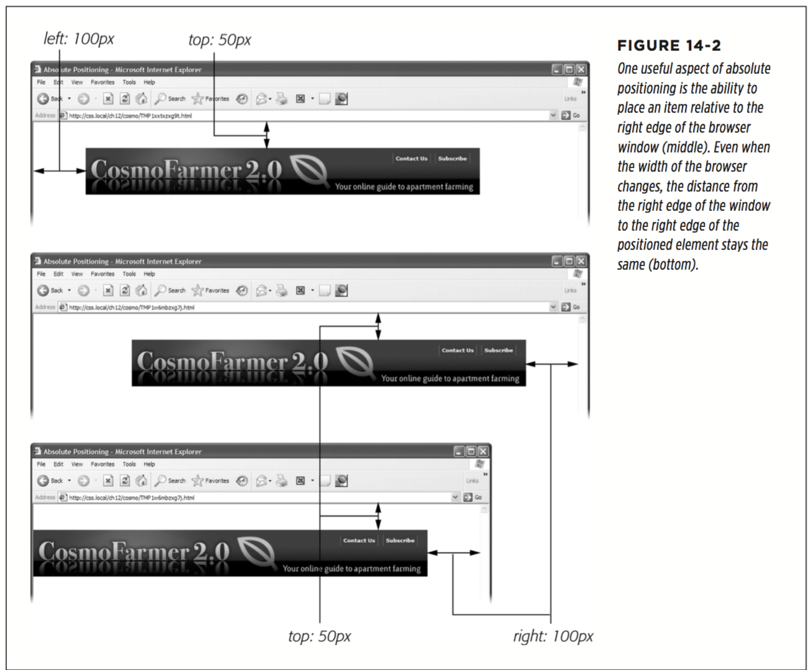

  Here’s another example: placing an element so it always remains a fixed distance from the right side of the browser. When you use the right property, the browser measures the distance from the right edge of the browser window to the right edge of the element (Figure 14-2, middle). To position the banner 100 pixels from the right edge of the window, you’d create the same style as above, but simply replace left with right:
  ```
  .banner {
    position: absolute; right: 100px;
    top: 50px;
    width: 760px;
  }
 ```

 Since the position is calculated based on the right edge of the browser window, adjusting the size of the window automatically repositions the banner, as you can see in Figure 14-2, bottom. Although the banner moves, the distance from the right edge of the element to the right edge of the browser window remains the same.

 You can even specify both left and right position properties as well as both top and bottom, and let the browser determine the width and height of the element. Say you want a central block of text positioned 10 percent from the top of the window and 10 pixels from both the left and right edges of the window. To position the block, you can use an absolutely positioned style that sets the top, left, and right properties to 10%. In a browser window, the left edge of the box starts from the left edge of the window to 10 percent of the window’s width, and the right edge extends to 10 percent from the right edge (Figure 14-3). The exact width of the box, then, depends on how wide the browser window is. A wider window makes a wider box; a thinner window, a thinner box. The left and right positions, however, are always 10 percent of the browser window’s width.

 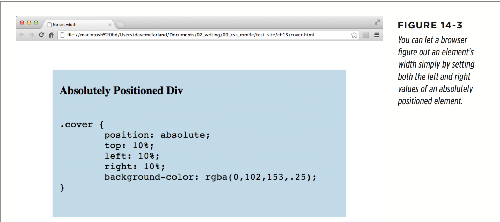

 The width and height properties, which you learned about in Chapter 7, work ex- actly the same way for positioned elements. To place a 50×50-pixel gray box in the top-right corner of the browser window, create this style:
 ```
 .box {
    position: absolute;
    right: 0;
    top: 0;
    width: 50px;
    height: 50px;
    background-color: #333;
  }
 ```

 The same caveat mentioned on page 206 applies here as well: Be careful with set- ting heights on elements. Unless you’re styling a graphic with a set height, you can’t be sure how tall any given element will be on a page. You might define a sidebar to be 200 pixels tall, but if you end up adding enough words and pictures to make the sidebar taller than 200 pixels, then you end up with content spilling out of the sidebar. Even if you’re sure the content fits, a visitor can always pump up the size of her browser’s font, creating text that’s large enough to spill out of the box. Fur- thermore, when you specify a width and height in a style and the contents inside the styled element are wider or taller, strange things can happen.

 * When Absolute Positioning Is Relative

 So far, this chapter has talked about positioning an element in an exact location in the browser window. However, absolute positioning doesn’t always work that way. **In fact, an absolutely positioned element is actually placed relative to the boundaries of its closest positioned ancestor.** Simply put, if you’ve already created an element with absolute positioning (say a `<div>` tag that appears 100 pixels down from the top of the browser window), then any absolutely positioned elements with HTML inside that `<div>` tag are positioned relative to the div’s top, bottom, left, and right edges.

 In the top image of Figure 14-4, the light gray box is absolutely positioned 5 ems from the top and left edges of the browser window.

 There’s also a `<div>` tag nested inside that box. Applying absolute positioning to that div positions it relative to its absolutely positioned parent. Setting a bottom position of 0 doesn’t put the box at the bottom of the screen; it places the box at the bottom of its parent. Likewise, a right position for that nested div refers to the right of the edge of its parent (Figure 14-4, bottom).

 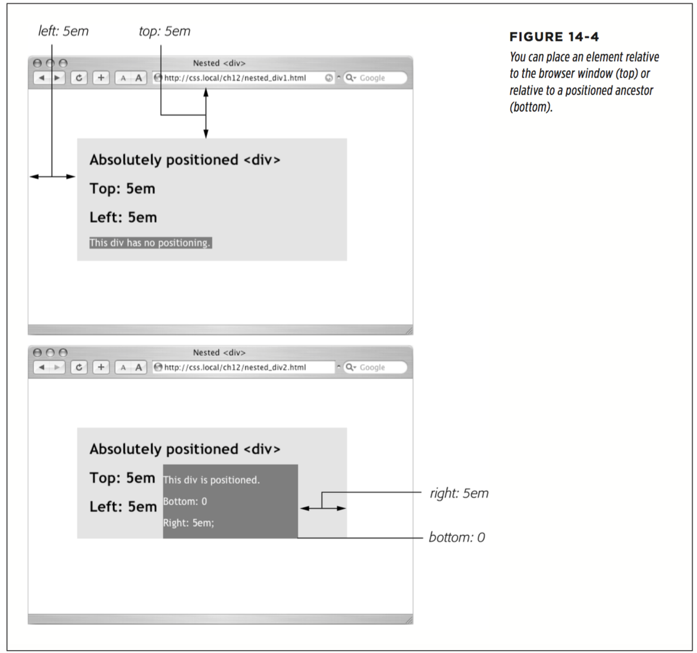

 Whenever you use absolute positioning to place an element on the page, the exact position depends upon the positioning of any other tags the styled element is nested in. Here are the rules in a nutshell:

  * A tag is positioned relative to the browser window if it has an absolute position and it’s not inside any other tag that has either absolute, relative, or fixed positioning applied to it.

  * A tag is positioned relative to the edges of another element if it’s inside another tag with absolute, relative, or fixed positioning.

 * When (and Where) to Use Relative Positioning

 You get one big benefit from placing an element relative to another tag: If that tag moves, the positioned element moves along with it. Say you place an image inside an `<h1>` tag, and you want the image to appear on the right edge of that `<h1>` tag. If you simply position the image in an exact spot in the browser window on the left edge of the `<h1>` tag, you’re taking your chances. If the `<h1>` moves, the absolutely positioned image stays glued to its assigned spot. Instead, what you want to do is position the image relative to the `<h1>` tag, so that when the headline moves, the image moves with it (bottom two images in Figure 14-5).

 You could use the position property’s relative value to place the image, but that has drawbacks, too. When you set an element’s position to relative and then place it—maybe using the left and top properties—the element moves the set amount from where it would normally appear in the flow of the HTML. In other words, it moves relative to its current position. In the process, it leaves a big hole where it would’ve been if you hadn’t positioned it at all (Figure 14-1, bottom). Usually, that’s not what you want.

 A better way to use relative positioning is to create a new positioning context for nested tags. For instance, the `<h1>` tag in the example at the beginning of this section is an ancestor of the `` tag inside it. By setting the position of the <h1> tag to relative, any absolute positioning you apply to the ` `tag is relative to the four edges of the <h1> tag, not the browser window. Here’s what the CSS looks like:

 ```
 h1 { position: relative; }
 h1 img {
      position: absolute;
      top: 0;
      right: 0;
 }
 ```
 Setting the image’s top and right properties to 0 places the image in the upper-right corner of the headline—not the browser window.

 In CSS, the term relative doesn’t exactly mean the same thing it does in the real world. After all, if you want to place the `` tag relative to the `<h1>` tag, your first instinct may be to set the image’s position to relative. In fact, the item that you want to position—the image—gets an absolute position, while the element you want to position the element relative to—the headline—gets a setting of relative. Think of the relative value as meaning “relative to me.” When you apply relative positioning to a tag, it means “all positioned elements inside of me should be positioned relative to my location.”

 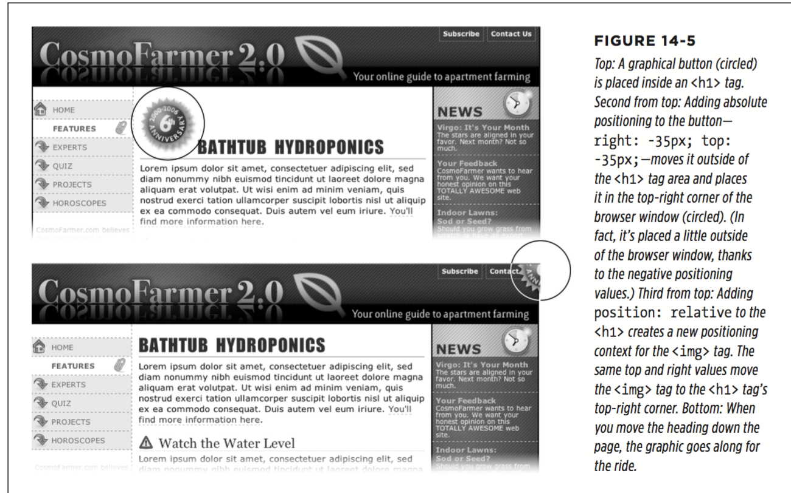
 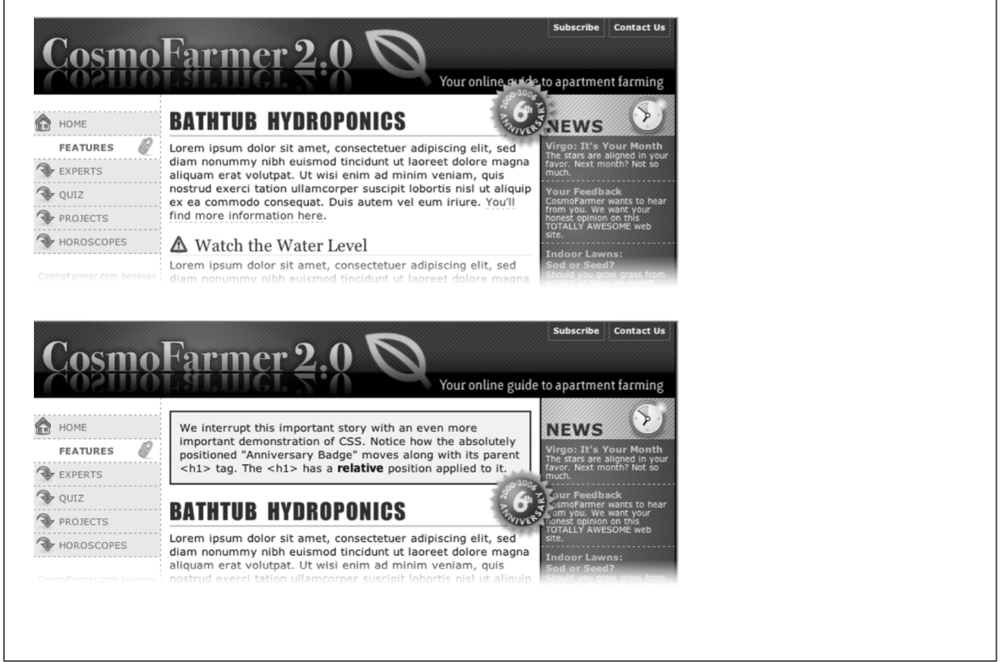

 * Stacking Elements

 As you can see in Figure 14-6, absolutely positioned elements sit “above” your web page and can even reside on top of (or underneath) other positioned elements. This stacking of elements takes place on what’s called the z-index. If you’re familiar with the concept of layers in Adobe Photoshop, Sketch, or Adobe Illustrator, then you know how the z-index works: It represents the order in which positioned elements are stacked on top of the page.

 Normally, the stacking order of positioned elements follows their order in the page’s HTML code. On a page with two absolutely positioned `<div>` tags, the `<div>` tag that comes second in the HTML appears above the other `<div>`. But you can control the order in which positioned elements stack up by using the CSS `z-index` property. The property gets a numeric value, like this: `z-index: 3;`

 The larger the value, the closer to the top of the stack an element appears. Say you have three absolutely positioned images, and parts of each image overlap. The one with the larger z-index appears on top of the others (see Figure 14-6, top). When you change the z-index of one or more images, you change their stacking order (Figure 14-6, middle).

 You can even use negative z-index numbers, which can come in handy when you want to position an element underneath its parent or any of its ancestors. For example, in the top image in Figure 14-6, the `<div>` tag is relatively positioned. If you wanted to place one of the images behind the `<div>`, you could use a negative z-index value: `z-index: -1;`

 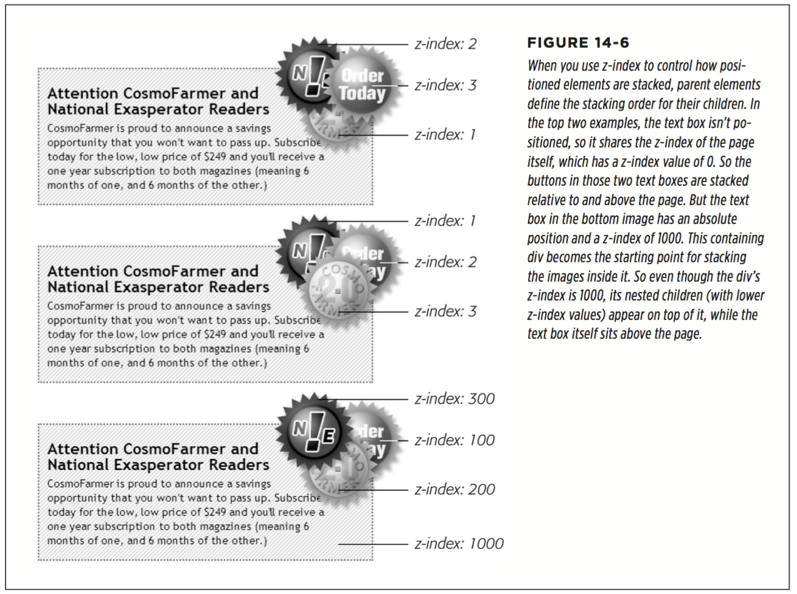

 * Hiding Parts of a Page

 `visibility: visible; visibility: hidden;`

 The visibility property’s hidden value is similar to the display property’s none value, but there’s a fundamental difference. When you set an element’s display property to none, it literally disappears from the page without a trace. However, setting the visibility property to hidden prevents the browser from displaying the element’s contents, but leaves an empty hole where the element would have been. When applied to absolutely positioned elements that are already removed from the flow of the page, visibility: hidden and display: none behave identically. Most developers simply use the display: none method and skip the visibility property entirely.

 There’s yet another way to hide an element—set its opacity to 0 like this: `opacity:0;  & opacity: 1;(make it reappear)`

 Example:
 1. Create the HTML for the image and caption
 ```
  <figure class="hat">
    
    <figcaption>A picture of a hat</figcaption>
  </figure>
 ```

 2. Position the caption
 ```
 .hat {
    position: relative;
    width: 100px;
    height: 100px;
  }
  .hat figcaption {
    position: absolute;
    bottom: 0
    left: 0;
    right: 0;
    background-color: white;
  }
  ```
  The caption is placed at the bottom of the figure (bottom: 0). With its left and right values set to 0, it will span the entire width of the figure.

  3. Hide the caption
  ```
  .hat figcaption {
    display: none;
    position: absolute;
    bottom: 0
    left: 0;
    right: 0;
    background-color: white;
  }
  ```

  4. Make the caption appear when a visitor mouses over the image
  ```
  .hat:hover figcaption {
    display: block;
  }
  ```

* Powerful Positioning Strategies

  * Positioning Within an Element

  One of the most effective ways to use positioning is to place small items relative to other elements on a page. Absolute positioning can simulate the kind of right alignment you get with floats. In the first example in Figure 14-8, the date on the top headline is a bit overbearing, but with CSS you can reformat it and move it to the right edge of the bottom headline.

  In order to style the date separately from the rest of the headline, you need to enclose the date in an HTML tag. The `<span>` tag is a popular choice for applying a class to a chunk of inline text to style it independently from the rest of a paragraph.

  `<h1><span class="date">Nov. 10, 2006</span> CosmoFarmer Bought By Google</h1>`

  Now it’s a matter of creating the styles. First, you need to give the containing element—in this example, the `<h1>` tag—a relative position value. Then, apply an absolute position to the item you wish to place—the date. Here’s the CSS for the bottom image in `#1` of Figure 14-8:

  ```
  h1 {
    position: relative;
    border-bottom: 1px dashed #999999;
  }
  h1 .date {
    position: absolute;
    bottom: 0;
    right: 0;
    font-size: .5em;
    background-color: #E9E9E9;
    color: black;
    padding: 2px 7px 0 7px;
  }
  ```

  * Breaking an Element Out of the Box

  You can also use positioning to make an item appear to poke out of another element. In the second example in Figure 14-8, the top image shows a headline with a graphic. That is, the `` tag is placed inside the `<h1>` tag as part of the headline. Using absolute positioning and negative top and left property values moves the image to the headline’s left and pushes it out beyond the top and left edges. Here’s the CSS that produces that example:
  ```
  h1 {
    position: relative;
    margin-top: 35px;
    padding-left: 55px;
    border-bottom: 1px dashed #999999;
  }
  h1 img {
    position: absolute;
    top: -30px;
    left: -30px;
  }
  ```
  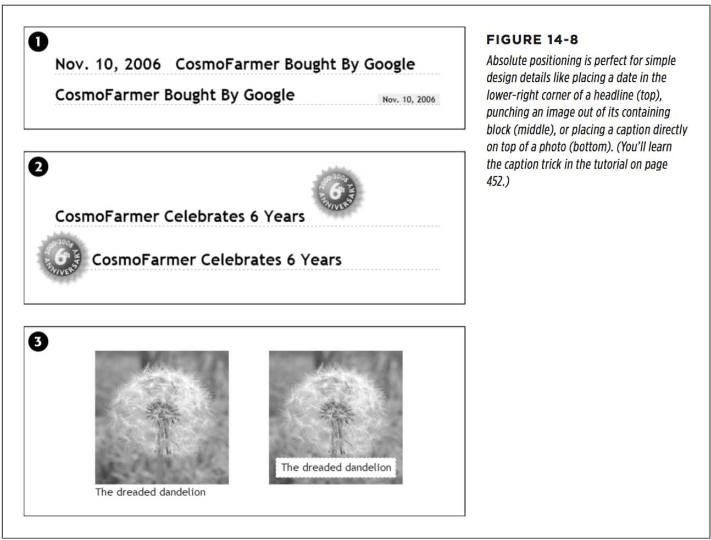

  * Creating CSS-Style Frames Using Fixed Positioning

  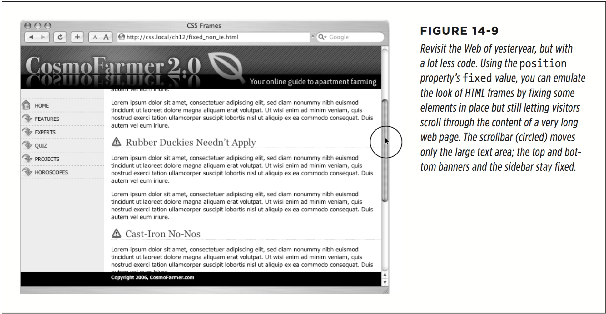

  Fixed positioning works much like absolute positioning in that you use the left, top, right, or bottom properties to place the element. Also like absolutely positioned elements, fixed positioning removes an element from the flow of the HTML. It floats above other parts of the page, which simply ignore it.

  Here’s how you can build the kind of page pictured in Figure 14-9, which has a fixed banner, sidebar, and footer, and a scrollable main content area:

  1. Add `<div>` tags with class(orID) attributes for each section of the page.

  You can have four main `<div>` tags with classes (or IDs) like banner, sidebar, main, and footer (Figure 14-10). The order in which you place these tags in the HTML doesn’t matter. Like absolute positioning, fixed positioning lets you place elements on a page regardless of their HTML order.

  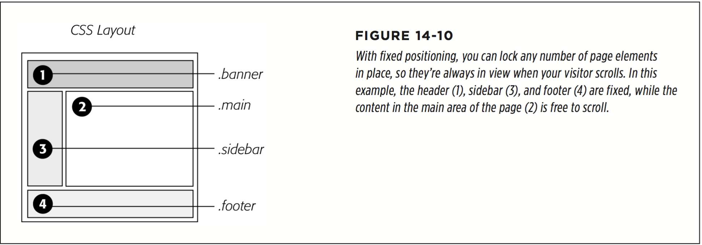

  2. Add your material to each div

  In general, use the fixed divs for stuff a visitor should always have access to in the areas you wish to be locked in place. In this example, the banner, sidebar, and footer contain the site logo, global site navigation, and copyright notices.

  The main content goes into the remaining `<div>` tag. Don’t add too much information to a fixed div, however. If a fixed sidebar is taller than the visitor’s browser window, he won’t be able to see the entire sidebar. And since fixed elements don’t scroll, there’ll be no way (short of buying a bigger monitor) for that visitor to see the sidebar content that doesn’t fit in his browser window.

  3. Create styles for all fixed elements

  The left, right, top, and bottom values are relative to the browser window, so just determine where on the screen you’d like them to go and plug in the values. Specify a width for the elements as well.

  ```
  .banner {
    position: fixed;
    left: 0;
    right: 0;
    top: 0;
  }
  .sidebar {
    position: fixed;
    left: 0;
    top: 110px;
    width: 175px;
  }
  .footer {
    position: fixed;
    bottom: 0;
    left: 0;
    right: 0;
  }
  ```

  4. Create the style for the scrollable content area

  Since fixed-position elements are removed from the flow of the HTML, other tags on the page have no idea the fixed-position elements are there. So, the `<div>` tag with the page’s main content, for example, appears underneath the fixed items. The main task for this style is to use margins to move the contents clear of those areas.
  ```
  .main {
    margin-left: 190px;
    margin-top: 110px;
  }
  ```
