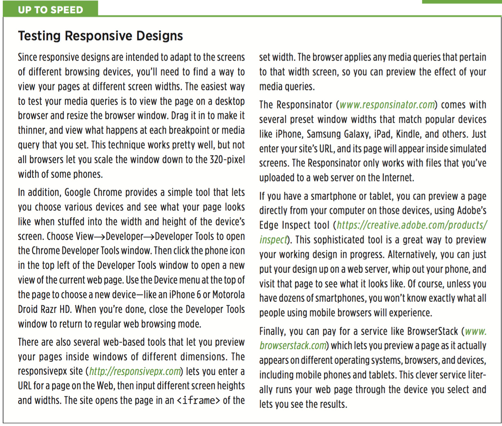

# chapter 15: Responsive Web Design

* Responsive Web Design Basics

RWD combines three main ideas: flexible grids for layout, flexible media for images and video, and CSS media queries to create different styles for different screen widths.

With flexible grids, you skip fixed-width layouts. Since smartphone screens come in a wide variety of widths, it makes no sense to create a page at a fixed width; instead, you want the page to grow or shrink to fit the particular device (this is the liquid layout concept discussed on page 386). Creating flexible media lets your images and videos scale to fit the appropriate screen real estate...big photos for big monitors, smaller photos for small screens, and so on.

Finally, media queries are a CSS technology that lets you send di erent styles to a browser based on current conditions in the browser. For example, you can send one set of styles when the screen is less than 480 pixels wide and another set when the window is more than 760 pixels wide. You’re not just limited to width, either; you can craft styles that only apply to tablets in landscape view or to devices with high-pixel density (like the Retina display on iPhone and iPads).

* Setting Up a Web Page for RWD

Simply add the following code to the <head> section of your web page (directly above the <title> tag is a good spot for it): `<meta name=”viewport” content=”width=device-width”>`

* Media Queries

Many designers think of three target screens related to the three most common web browsing devices: smartphones, tablets, and desktop computers. Granted, there’s a wide variety of widths for these devices...you can have small phones, large phones, 7” tablets, 10” tablets, and so on, so there’s no one width for all of these devices. Just keep in mind that the goal is to make a page look good at varying widths; you can simply test out different designs and different window widths to see when a four-column design needs to become a two-column or a one-column design.

  * Strategies for Using Media Queries
    * Adjust columns
    * Flexible widths (use percentage rather than pixels)
    * Tighten up white space
    * Adjust font sizes
    * Changing navigation menus (https://css-tricks.com/convert-menu-to-dropdown/)
    * Hide content on hand held devices
    * Use background images
    ```
      .logo {
          width: 960px;
          height: 120px;
          background-image: url(images/large_logo.png)
      }
      .logo {
          width: 100%;
          height: 60px;
          background-image: url(images/small_logo.png)
      }
    ```
  * Creating Breakpoints

  It’s common to create three sets of media queries for three different breakpoints—one for smartphones, one for tablets, and one for desktop monitors. The exact break- point you use will vary from design to design (as well as from device to device), but here’s a common starting point: A screen less than 480 pixels gets one set of styles, a screen between 481 and 768 gets another set of styles, and anything over 768 gets the desktop design. However, it’s up to you. Some designers make the tablet design go up to 1024 pixels, and send desktop styles to browsers wider than 1024.

  * Desktop First or Mobile First

  * Creating Media Queries
  ```
    <link href="css/small.css" rel="stylesheet" media="(max-width:480px)">
    <link href="css/large.css" rel="stylesheet" media="(min-width:769px)">
    <link href="css/medium.css" rel="stylesheet" media="(min-width:481px) and (max-width:768px)">
  ```

  * Including Queries Inside a Style Sheet

  The technique demonstrated above provides one way to use media queries by using the `<link>` tag to load different style sheets for different screen sizes. However, you can also add media queries within a single style sheet. You may want to do this so you don’t have to add multiple `<link>` tags to an HTML file, for example, or you may want to keep your media-query styles together with your main style sheet. Most web designers use this approach, rather than using separate files for each media query.

    * Usethe `@import` directive

    The `@import` directive lets you load additional external style sheets within either an internal or external style sheet. You can also use `@import` with a media query. For example, say you want to load an external style sheet named small.css containing styles for displays that are 320 pixels or smaller. To do that, add the `@import` directive directly to a style sheet: `@import url(css/small.css) (max-width:320px);`

    You must place `@import` directives at the beginning of a style sheet.They can’t come after any styles. As a result, you may run into problems with the cascade, where styles you defined in an external style sheet and loaded using `@import` can be overridden by later styles in the style sheet. You can get around it by simply having one external style sheet that only contains `@import` directives. The first loads a basic style sheet for all devices, and the second and third load style sheets using media queries, like this:
    ```
      @import url(css/base.css); /* no media query, applies to all */
      @import url(css/medium.css) (min-width:481px) and (max-width:768);
      @import url(css/small.css) (max-width: 480px);
    ```

    * Embed the media query in the style sheet
    ```
      @media (max-width: 480px) {
          body {
              /*style properties go here*/
          }
          .style1 {
              /*style properties go here*/
          }
      }
    ```

    The `@media` directive acts as a kind of container for all of the styles that match the query. So in this example, the body and .style1 styles only apply to devices whose screen is no wider than 480 pixels. By using embedded `@media` directives like this, you can keep all of your styles organized into one style sheet. A good approach is to start your external style sheets with styles that aren’t contained in a media query using either the desktop-first or mobile-first approach, and then add media queries for the remaining devices. This is the most common approach used by web designers.

    * A Basic Style Sheet Structure
    ```
      /* Put your reset styles here */
      /* Put styles for desktop and basic styles for all devices here */
      body {
        /* properties for body here */
      }

      /* medium display only */
      @media (min-width: 481px) and (max-width:768px) {
        body {
          /* properties that only apply to tablets */
        }
      }

      /* small display only */
      @media (max-width:480px) {
        body {
          /* properties that only apply to phones */
        }
      }
    ```

    * Mobile First
    ```
    /* Put your reset styles here */
    /* Put styles for mobile and basic styles for all devices here*/
    body {
      /* properties for body here */
    }

    /* medium display only */
    @media (min-width: 481px) and (max-width:768px) {
      body {
        /* properties that only apply to tablets */
        }
    }

    /* large display only */
    @media (min-width:769px) {
      body {
        /* properties that only apply to phones */
      }
    }
    ```

* Flexible Grids

Flexible grids are a core component of responsive web design. They’re nothing much more than the liquid layout discussed on page 386, in which the page’s overall width resizes to fit different width screens. In most cases, that means you set the width to 100%. However, for desktop displays, you may want to use the max-width property (page 208) to make sure the page isn’t absurdly wide on large desktop monitors.

In addition, the individual columns within a design should be percentage-based, instead of set with a fixed pixel- or em-based measurement. Individual columns also need to grow wider or narrower to fit the changing page width.

For example, say you want to create a two-column design where the first column is one-third the width of the page and the second is two-thirds. You may start with some simple HTML, like this:

```
<div class="columns">
  <div class="one-third">
    ...content goes here...
  </div>
  <div class="two-thirds">
    ...content goes here...
  </div>
</div>
```

You can then use several CSS styles to create the fluid layout:
```
  .columns {
    width: auto; /* same as 100% */
    max-width: 1200px;
  }
  .columns:after {
    content: "";
    display: table;
    clear: both;
  }
  .one-third {
    float: left;
    width: 33%;
  }
  .two-thirds {
    float: left;
    width: 67%;
  }
```

  * The Importance of HTML Source Order

  When you’re holding a phone upright in your hand, there’s simply not enough room to have two, let alone three, columns in a row and still have a readable page, so many designers simply lay out a page in one long column for display on a mobile phone. To do so, just remove any floats from the columns you’ve created. For example, if you create a three-column design for desktop display using floats to position the columns side by side, simply set the float property to none on those elements. They then display as HTML normally does—one block-level tag on top of the other.

  This makes the HTML source order very important. For example, a page may have two sidebars, one with a list of links to related sites, the other with ads for products your company sells. A middle column contains the main content—the stuff  your audience is really after when they visit the page. One way to lay this out in columns is to float the first sidebar left and the second sidebar right, and let the main column simply wrap around the two and sit in the middle.

  In terms of HTML, this would mean the two sidebar divs appear first, followed by the tag containing the main content. If you made this page mobile-friendly by removing the floats on these sidebars, you’d end up with the two sidebars appearing above the main content. Your audience would be faced with scrolling down past the ads and links just to get to the content they’re after.

  A more user-friendly approach is to place the main content container above the sidebars. As discussed on page 403, this method can require adding some additional containers and floating all the elements, including the main content div.

  * Reset the Box Model

  As explained on page 414, when you use percentage-based widths, you run into the danger of float drops, where the total width of columns in a row exceeds 100 per- cent, so the last column drops down below the others. Because of the way browsers calculate the widths of elements, adding a border around a div, or padding inside it, will make the div’s onscreen width greater than the width you set in the CSS.

  ```
  *{
    box-sizing: border-box;
  }
  ```

  * Fluid Images

  While a flexible layout creates a design that works in a wide range of browser window widths, you’ll encounter a problem if you’ve inserted images in your pages. Although columns in a flexible design shrink as the window gets smaller, images usually don’t. This can lead to graphics overflowing their bounds and no longer fitting within the width of a column (see Figure 15-3).

  Fortunately, there’s a way to make images flexible as well. It requires two steps: a new CSS style and some changes to your HTML.

  First,in your stylesheet,add the following style: `img { max-width: 100%; }`

  This sets the maximum width of any image to 100 percent of the width of its container. In other words, an image can never be bigger than a column, div, or any HTML element that it sits inside of.

  This alone isn’t enough to make an image flexible. Usually, when you insert an `` tag, you also add the height and width for that image. That’s the size the browser uses when displaying the image. With the max-width property in place, the image won’t get wider than the column, but its height is still locked to the value set in the HTML. In other words, the image will conform to the width of the column, but its height won’t change, resulting in a distorted image. The solution is straightforward: Just remove the width and height attributes from the HTML.

  This approach assumes, of course, that you want all your images to fill the column they’re in. In many cases, you’ll want images to be smaller than that; for example, a photo that’s floated to the right of the main column, with text wrapping around it. To deal with differently sized images, you can create different classes, with different max-width settings, and apply those classes to particular `` tags within the HTML.

  ```
    .imgSmallLeft {
      float: left;
      max-width: 40%;
    }

    
  ```

  

  * Videos and Flash
  ```
  img, video, embed, object {
        max-width: 100%;
  }
  ```

  Unfortunately, this style doesn’t do anything to help with videos that are embed- ded using iframes (the most common way to add a YouTube or Vimeo video to a page). For embedded YouTube videos, read this article—http://demosthenes.info/blog/649/Responsive-Design-Create-Fluid-YouTube-and-Vimeo-Content—or simply use the Embed Responsively service (http://embedresponsively.com). Just give this website the URL of the YouTube or Vimeo video, and it will generate the HTML code you need to embed a responsive version of the video on a web page.
