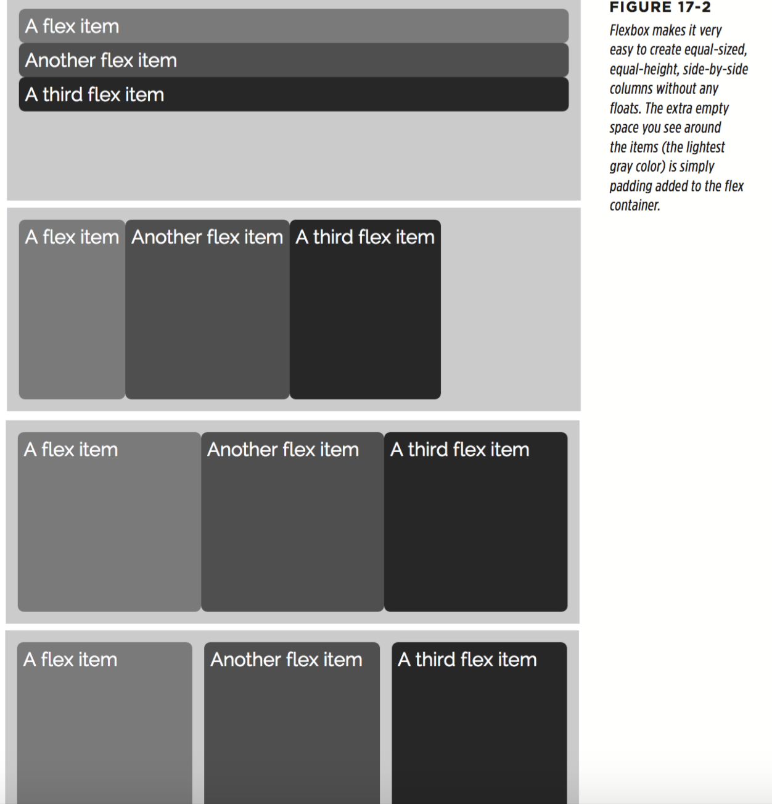

# chapter 17 : Modern Web Layout with Flexbox

* Flexbox Basics

On the surface, flexbox is pretty simple. There are only two components you need to make it work:

  * The Flex container

  Any HTML element can be a flex container, but usually you'll use a `<div>` or some other structural HTML tag. The tag you use for the flex container will contain children and other tags that make up the second part of the flexbox model.

  * Flex items

  Tags nested directly inside the flex container element are called flex items. Every direct child of the container element is automatically turned into a flex item. You can place any HTML tag inside the flex container. What's more, the child tags don't even have to be of the same type. For example, you could have one paragraph and four divs inside a flex container, and each of those will be a flex item.

  Keep in the mind that only children of the flex container turn into flex items. If you had a `<div>` tag that you turned into a flex container and placed an unordered list inside it, only the `<ul>` tag would be a flex item. The `<li>` tags nested inside the `<ul>` tag would not be flex items.

In other words, as you're probably used to by now, flexbox is as easy as adding a `<div>` to a page and nesting additional divs inside it. For example, here's some simple HTML that can easily be used to create a row of items using flexbox:

```
<div class="container">
  <div>A flex item</div>
  <div>Another flex item</div>
  <div>A third flex item</div>
</div>
```

The outer div is the container, and the divs inside are the child elements. A browser will display this series of divs as block-level items, filling the entire width of the outer div and stacked one on top of the other as pictured in the top image in Figure 17-2.

However, you can easily transform the outermost div into a flex container using the display property and setting its value to flex like this:

```
.container {
  display: flex;
}
```

That single line of CSS gives you the second image from the top in Figure 17-2. Each of the child divs are converted automatically into flex items and placed side by side in a row: no floats or inline-blocks needed.

Unfortunately, at the time of this writing, Safari requires a vendor prefix for this property, so to make the above CSS work in all current browsers including Safari, you would write:

```
.container {
  display: -webkit-flex;
  display: flex;
}
```

Finally, you can make the divs inside the container the same width and fill up the container by simply giving those divs a flex property with a value of 1, like this:

```
.container div {
  -webkit-flex: 1;
  flex: 1;
}
```

Because flex items automatically touch, you might want to add some space to separate each of them. There are many ways to do that, but here’s one simple solution for this particular example:

```
.container div:nth-of-type(1n+2) {
  margin-left: 20px;
}
```

This results in the bottom image in Figure 17-2.

Conceptually, flexbox is pretty simple. As you can see, there’s not a lot of CSS required to achieve this effect. Best of all, you don’t have to worry about items escaping from their containers as you do with floated elements (page 405), and you can easily create equal-height columns. The only thing that makes flexbox diffcult is understanding the large number of flexbox properties and imagining the almost limitless combinations of them all.



* Flex Container Properties

There are a handful of properties specific to just flex containers, the most important of which is the display property. To transform any HTML tag into a flex container:

```
display: -webkit-flex
display: flex;
```
You’ve seen the display property before. You also use it to turn items into block-level elements or inline-block elements, and even to hide them: display: none;. You use the same property to convert an element into a flex layout.

Remember that you apply this property to the container element—an element that wraps around other tags, which will become the flex items. You can even turn a flex item into a flex container for some interesting effects. You’ll see an example of that technique on page 559.

  * Flex-Flow

  Flex items, by default, are placed side by side as items in a row. In addition, a browser will display those flex items in a single row, without wrapping. In other words, no matter how narrow you make the browser window, the browser will keep those items side by side without dropping one below another—even if this makes content flow outside of a flex item (Figure 17-3, left).

  

  The flex-flow property lets you control both the direction in which the items are displayed and whether or not they can wrap onto the next line. Flex-flow requires two values, separated by a space. The first is the direction and the second is whether the item can wrap. For example:

  ```
  .container {
    display: -webkit-flex;
    display: flex;
    -webkit-flex-flow: column-reverse nowrap;
    flex-flow: column-reverse nowrap;
  }
  ```

  The first property value is the direction, and there are four possible settings:

    * row

    * row-reverse

    * column

    * column-reverse

  The second property controls whether flex items will wrap onto a new row (when using the row direction option) or onto a new column (when using the column direction option.) There are three possible values:

    * nowrap

    * wrap

    * wrap-reverse

  Flex items can be placed side by side in a row or stacked on top of each other in a single column, depending on which direction property you set (row or column). However, since the row option is most useful for page layout, the examples in the rest of this chapter on flexbox will apply to flex items laid out in a row.

  

  
  

  * Justify-content

  The justify-content property determines where a browser should place the flex items within the row. This property only works if the flex items have set widths and if the total width of the items is less than the flex container. If you’re using flex widths (page 546) for flex items, the justify-content property has no effect at all. There are five possible values for this property:

    * flex-start

    * flex-end

    * center

    * space-between

    * space-around

  To use this property you add it to the style formatting the flex container. You also need to make sure that the items have a set width. For example, to get the layout pictured in `#5` in Figure 17-5, you could use CSS code like this:
  ```
  .container {
    display: -webkit-flex;
    display: flex;
    -webkit-justify-content: space-around;
    justify-content: space-around;
  }
  .container div {
    width: 200px;
  }
  ```

  

  * Align-items

  The align-items property determines how flex items of diffrent heights are vertically placed within a flex container. By default, flex items stretch to fit the container, so are all equal heights (see `#5` in Figure 17-6). However, there are several other options:

    * flex-start

    * flex-end

    * center

    * baseline

    * stretch

    

  These settings have a different effect when a flex container’s direction is column (page 532). In that case, the align-items property controls where stacked flex items of different widths are placed horizontally within the flex container.

  To use the align-items property, add it to the style formatting the flex container. For example, to get the layout pictured in `#2` in Figure 17-6, you could use CSS code like this:

  ```
  .container {
      display: -webkit-flex;
      display: flex;
      -webkit-align-items: flex-end;
      align-items: flex-end;
  }
  ```

  * Align-content

  The last property you can apply to a flex container is the align-content property. This property dictates how a browser places flex items that span over multiple lines. This property only works if two conditions are true: First, the flex container must have wrap turned on (page 532); second, the flex container must be taller than the rows of flex items. In other words, there must be additional vertical space inside the container that’s greater than the combined heights of the rows of items. This isn’t that common a situation, but you may find a time when you’ll need it.

  This align-content property supports six values:

  


* Flex Item Properties

Setting properties on the flex container element is just the beginning. There are a handful of additional properties that you can apply to flex items—the direct children of the flex container—which control the order in which those items are displayed, their widths, and how they are aligned within the container.

  * The Order Property

  The order property lets you assign a numeric value to a flex item which dictates where within the row (or column) this item should appear. The HTML source order doesn’t matter at all: You can make the last block of HTML appear first in the row, or the first block last (Figure 17-8, bottom).

  

  * Align-self

  The align-self property works just like the align-items property used for flex containers. However, whereas align-items applies to all the flex items within a container, align-self applies to just the individual flex item. You apply the property to an item (not the container) and it overrides any value for the align-items property. In other words, you could align all of the flex items inside a container to the top of the container, but have just a single item align to the bottom.

  The possible values for align-self are the same as align-items (see page 537) and produce the same effect, but just for individual flex items (see Figure 17-9).

  * Flex

  The first value you supply to flex is a number that indicates the relative width of that flex item. For example, if you have three divs inside a flex container, you can set each of their flex values to 1 to make them all the same width.

  The second value you can set for the flex property is also a number, but it represents the flex-shrink property. This property comes into play when the container is not as wide as the total of the widths of the items inside it. In this case, flex-shrink controls how narrow a flex item can be, or how much it can shrink, and it’s dependent upon flex items having set widths, which is the job of the final value of the flex property. The next section will discuss that value first, and then return to how the flex-shrink property works.

  The last value is the flex-basis property, which sets a base width for a flex item. You can use an absolute value like 100px or 5em, or a percentage value like 50%. You can think of the flex-basis value as a kind of minimum width for a flex item. When you set the flex-basis value, it sets a width for that item, but depending on other flex settings, the flex item may grow larger (or smaller) than the flex-basis value.

  For example, in the top image in Figure 17-12, the flex-basis value for each item is 250px. The first value is 0—that’s the value that determines how much the item flexes or grows. When it’s set to 0, it doesn’t grow, so the item’s width matches the flex-basis value of 250 pixels.

  However, whenever you provide a number greater than 0 for that first value, the entire width of the row will be filled. So in the middle image in Figure 17-12, although the flex-basis value for each item is 250px, the actual width of the items varies, because the flex-grow values are different—1, 2, and 4, respectively.

  

  * Digging into the Math

  So how exactly does the browser figure out how wide a flex item should be when both a flex-grow and flex-basis value are set? Strap in, ’cause it’s time to do a bit of math. It isn’t all that diffcult, but you will have to wade through a bunch of addition, subtraction, division, and multiplication.

  Take a look at Figure 17-13. It’s a single flex container holding three flex items. Be- cause each item has a flex-grow property value greater than 0, those items will grow to fill the entire width of the container, which is 1000 pixels wide. They also have different flex-basis values: 300, 200, and 100 pixels. Start by totaling those minimum widths:

  300 + 200 + 100 = 600

  This value, 600, is the total amount of space the items want to take up. However, the container is wider than that—it’s 1000 pixels wide. So you can determine how much extra space remains by subtracting the item widths from the container width:

  1000 – 600 = 400

  In other words, the browser has 400 pixels of extra space that it has to figure out what to do with. So, it looks at the various flex-grow values—1, 3, and 4—and de- termines how to divide the remaining space. 1 + 3 + 4 is 8, so the first item should get 1/8 of the leftover space. 1/8 of 400 (which is the same as 400/8) is 50. The first item’s width is the total of its flex-basis value and its share of the leftover space:

  300 + 50 = 350 pixels

  The second item should get 3/8 of the remaining space added to its flex-basis value:

  200 + (50 * 3) = 350 pixels

  And the last item receives 1⁄2 of the 400 pixel leftovers, so its width is

  100 + 200 = 300 pixels

  There is some method to all of this math madness, and as you can see, there’s a lot of work the browser has to do to set the width of flex items. You’ll find some simple rules of thumb for choosing values for the flex property on page 553.

  

  * Returning to the Flex-Shrink Property

  The second value for the flex property determines how much a flex item may shrink if the total of the widths of the items is wider than the container. This value is only important if the container has the nowrap setting (page 552), so that all of the items must sit next to each other in a single row.

  For example, the flex containers for the examples pictured in Figure 17-14 are 1000 pixels wide. Because the flex-basis value of each item is 400 pixels (totaling 1200 pixels for all three), they can’t fit within the container without shrinking. In the first row, the items all share the same flex-shrink value: 1. This means they’ll all shrink (decrease in width) by the same amounts.

  However, in the middle row in Figure 17-14, the first item has a flex-shrink value of 1, while the other two have flex-shrink values of 4. So the items aren’t all the same widths. Unlike flex-grow, where the bigger the number the wider the item can be, the flex-shrink value determines how much narrower an item can become in rela- tion to other items in the same row. This means the larger the flex-shrink value, the narrower an item is allowed to be. So, in the middle row in Figure 17-14, two items on the right are narrower, because their flex-shrink values are larger.

  The flex-shrink value adds another layer of complexity in trying to picture how flex items work. Because of this, and because it has no e ect when the flex container allows items to wrap, you can simply use a flex-shrink value of 1 most of the time.

  

  * Wrapping Flex Items

  The real value of the flex-basis property comes into play when you set a flex container to allow wrapping:
  ```
  .container {
    display: -webkit-flex;
    display: flex;
    -webkit-flex-flow: row wrap;
    flex-flow: row wrap;
  }
  ```

  When wrapping is enabled, flex items will drop to another row when they cannot fit within the container. For example, imagine you have a flex container with a width of 1000 pixels, and you have three flex items, each with a flex-basis of 400. Be- cause 400 + 400 + 400 is more than 1000 pixels, the three flex items can’t all fit. However, since 400 + 400 is less than 1000 pixels, two of the items can fit side by side in a single row.

  In this case, the browser will display the first two items in a single row and wrap the third item onto its own row (Figure 17-15, top). Because the three items each have a flex-grow property, they will fill the entire row, so the bottom item, which sits by itself, will stretch to fill the entire width of the container.

  If the container shrinks so that no flex items can fit side by side, the browser then places each flex item on its own row (Figure 17-15, bottom).

  
