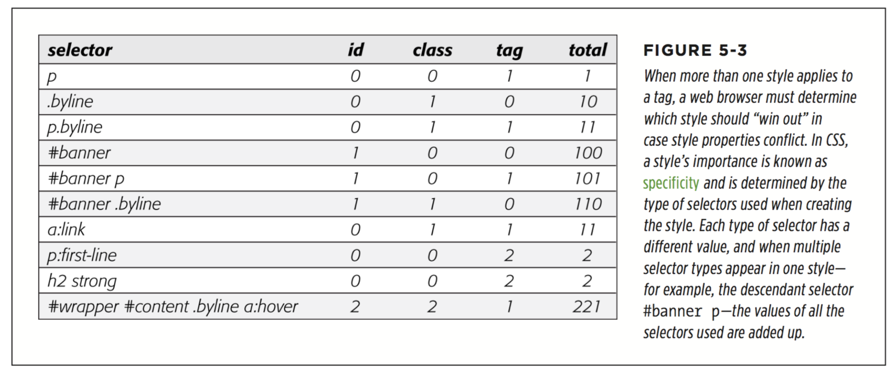

# chapter5 : Managing Multiple Styles: The Cascade

* Nearest Ancestor Wins
* The Directly Applied Style Wins (This rule explains why some inherited properties don’t appear to inherit. A link inside a paragraph whose text is red still appears browser-link blue. That’s because browsers have their own predefined style for the <a> tag, so an inherited text color won’t apply.)

* One Tag, Many Styles
Inheritance is one way that a tag can be a ected by multiple styles. But it’s also pos- sible to have multiple styles apply directly to a given tag. For example, say you have an external style sheet with a 
 tag style and attach it to a page that has an internal style sheet that also includes a 
 tag style. And just to make things really interesting, one of the 
 tags on the page has a class style applied to it. So for that one tag, three di erent styles directly format it. Which style—or styles—should the browser obey?

* Specificity: Which Style Wins
  * A tag selector is worth 1 point.
  * A class selector is worth 10 points.
  * An ID selector is worth 100 points.
  * An inline style (page 28) is worth 1,000 points.

  A pseudo-element(like::first-line for example) is treated like a tag selector and is worth 1 point. A pseudo-class (:link, for example) is treated like a class and is worth 10 points.

