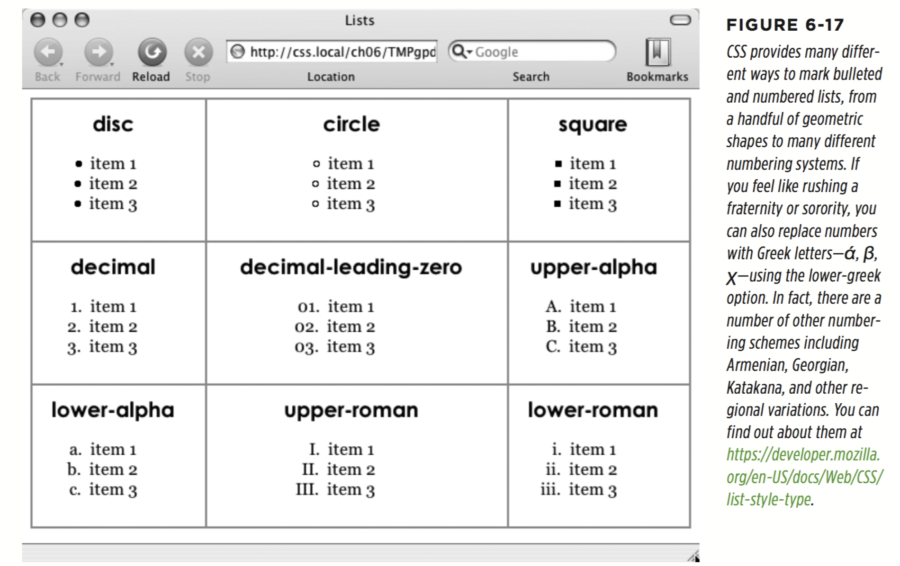
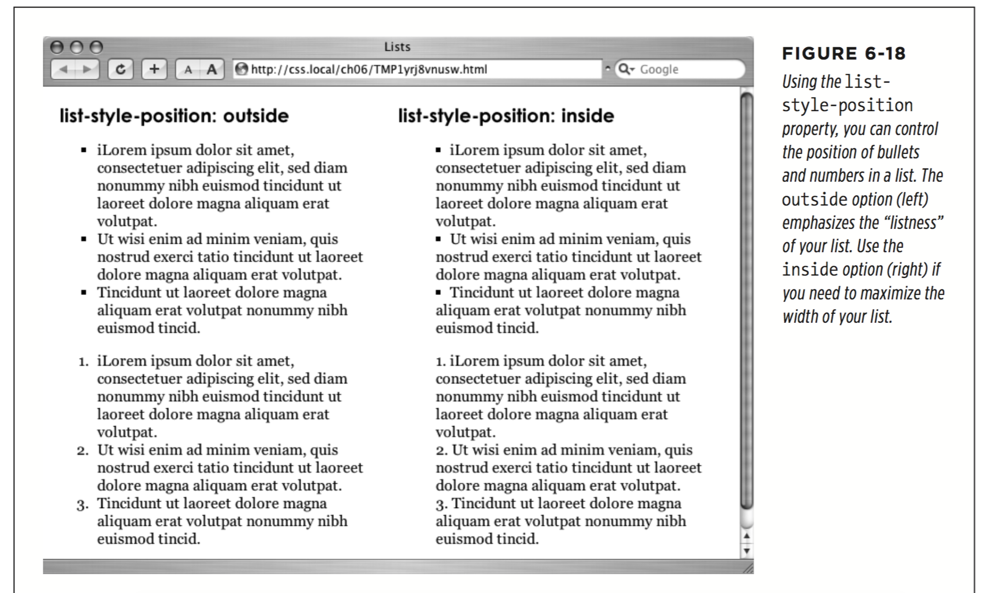
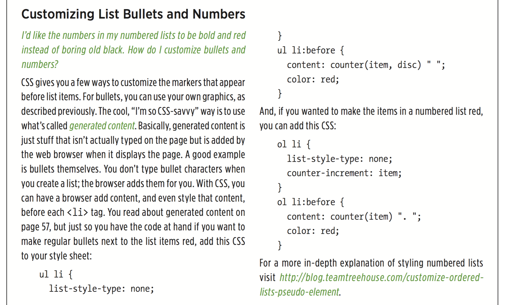

# chapter6: Formatting Text

* Using Fonts
  * More recently, web browsers began supporting web fonts—fonts that the browser downloads and uses while viewing your site. Web fonts use the font-family property as well, but require an additional CSS command called the `@font-face` directive, which instructs a web browser to download the specified font. Web fonts open up many exciting design possibilities, letting you choose from a wild array of typefaces. But, as you’ll learn on page 126, they also come with their own set of challenges.
  ```
  # if you’re not worried about Internet Explorer 8 or earlier, you can simplify this even more:

  @font-face {
    font-family: 'League Gothic';
    src: url('fonts/League_Gothic-webfont.woff2') format('woff2'),
         url('fonts/League_Gothic-webfont.woff') format('woff');
  }

  p {
    font-family: "League Gothic", "Times New Roman", Arial, Helvetica, sans-serif;
    font-weight: normal;
  }
  ```
  * Use Google Fonts! https://fonts.google.com/

* Adding Color to Text
  * hex
  * RGB
  * RGBA

* Changing Font Size
  * pixel
  * percentage (Every browser has a preprogrammed base text size, which in most browsers is 16 pixels.)
  * em (similar to percentage)

  The above examples are pretty straightforward, but here’s where it gets a little tricky: Font size is an inherited property (as discussed in Chapter 4), so any tags inside of a tag that has a font size specified inherit that font size. So the exact size of 100% can change if a tag inherits a font-size value.

  For example, at the lower left of Figure 6-11, there’s a `<div>` tag that has its font size set to 200%. That’s two times the browser’s base text size, or 32 pixels. All tags inside that `<div>` inherit that text size and use it as the basis for calculating their text sizes. In other words, for tags inside that `<div>`, 100% is 32 pixels. So the `<h1>` tag inside the `<div>` that has a font size of 100% displays at two times the base-text size for the page, or 32 pixels.

  * rem

  CSS includes another measurement unit called rem. No, it’s not named after sleep patterns or a band. It stands for root em—meaning its value is based on the text size of the root element. In most cases this just means the base text size, so you can change the .75em shown in Figure 6-11 to this:
  ```
    font-size: .75rem;
  ```

  This style makes the font size .75 of the base text size, not the inherited font size (as is the case with ems). The root element in HTML is actually the html element you find at the beginning of a web page. When using rem values, you can set the base text size of the html element and then use rem units to set text to a size relative to that. For example, you can set the base text size to 20 pixels like this:
  ```
  html {
    font-size: 20px;
  }
  ```

  Then use rem units to create fonts in relation to that 20-pixel base text size. For example, to then make all paragraphs 15 pixels in size, add this style:

  ```
  p{
    font-size: .75rem;
  }
  ```

* Formatting Words and Letters
  * Italicizing and Bolding
  ```
    font-style: italic; font-style: normal;
    font-weight: bold; font-weight: normal;
  ```

  * Capitalizing
  ```
    text-transform: uppercase;
  ```

  * SMALL CAPS
  ```
    font-variant: small-caps;
  ```

* Decorating (underline, overline, line-through, or blink)
  ```
    text-decoration: underline overline;
    text-decoration: none;
  ```

* Letter and Word Spacing
  ```
     letter-spacing: -1px;
     letter-spacing: .7em;
     word-spacing: 2px;
  ```

* Adding Text Shadow

The text-shadow property requires four pieces of information: the horizontal o set (how far to the left or right of the text the shadow should appear), the vertical o set (how far above or below the text the shadow should appear), the blurriness of the shadow, and the color of the drop shadow.
  ```
    text-shadow: -4px 4px 3px #999999;
  ```

* Formatting Entire Paragraphs
  * Adjusting the Space Between Lines `line-height: 150%;`
  * Aligning Text `text-align: center; (left, right, justify, center)`

* Indenting the First Line and Removing Margins
  * FIRST-LINE INDENTS `text-indent: 5em; text-indent: 25px;`
  You can also use a percentage value, but with the text-indent property, percent- ages take on a di erent meaning than you’ve seen before. In this case, percentages aren’t related to the font size; they’re related to the width of the element containing the paragraph. For example, if the text-indent is set to 50%, and a paragraph spans the entire width of the web browser window, then the first line of the paragraph starts half the way across the screen.

  * CONTROLLING MARGINS BETWEEN PARAGRAPHS
  To eliminate the gaps between all paragraphs on a page, create a style like this:
  ```
  p{
    margin-top: 0; margin-bottom: 0;
  }
  ```

  * Formatting the First Letter or First Line of a Paragraph
  ```
     p::first-letter {
      font-weight: bold;
      color: red;
    }
    p.intro::first-letter {
     font-weight: bold;
     color: red;
   }
   .intro::first-line { text-transform: uppercase; }
  ```

* Styling Lists
  * Types of Lists
  Most web browsers display unordered lists (`<ul>` tags) using round bullets, and num- bered lists (`<ol>` tags) using...well...numbers. With CSS, you can choose from among three types of bullets—disc (a solid round bullet), circle (a hollow round bullet), or square (a solid square). There are also six di erent numbering schemes—decimal, decimal-leading-zero, upper-alpha, lower-alpha, upper-roman, or lower-roman. You select all these options using the list-style-type property, like so:
  ```
     list-style-type: square; list-style-type: upper-alpha;
  ```

  Most of the time, you use this property on a style that’s formatting an `<ol>` or `<ul>` tag. Typical examples include an ol or ul tag style—ul { list-style-type: square; }—or a class you’re applying to one of those tags. However, you can also apply the property to an individual list item (`<li>` tag) as well. You can even apply di erent types of bullet styles to items within the same list. For example, you can create a style for a `<li>` tag that sets the bullets to square, but then create a class named .circle that changes the bullet type to circle, like this:
  ```
   li {list-style-type: square; }
    .circle { list-style-type: circle; }
  ```
  You can then apply the class to every other item in the list to create an alternating pattern of square and circular bullets:
  ```
    <ul>
      <li>Item 1</li>
      <li class="circle">Item 2</li>
      <li>Item 3</li>
      <li class="circle">Item 4</li>
    </ul>
  ```
  or
  ```
    li {list-style-type: square; }
    li:nth-of-type(odd) { list-style-type: circle; }
  ```

  At times you’ll want to completely hide bullets, like when you’d rather use your own graphic bullets. Also, when a site’s navigation bar is a list of links, you can use an `<ul>` list, but hide its bullets. To turn o  the bullets, use the keyword none:
  ```
    list-style-type: none;
  ```

  

  * Positioning Bullets and Numbers
  `list-style-position: outside; list-style-position: inside;`

  In addition, if you don’t like how web browsers indent a list from the left edge, then you can remove that space by setting both the margin-left and padding-left properties to 0 for the list. To remove the indent from all lists, you can create this group selector:
  ```
   ul, ol {
      padding-left: 0;
      margin-left: 0;
    }
  ```

  

  * Graphic Bullets `list-style-image: url(images/bullet.gif);`

  
  http://blog.teamtreehouse.com/customize-ordered-lists-pseudo-element
