# chapeter 7: Margins, Padding, and Borders

* Understanding the Box Model
  * padding is the space between the content and the content’s border.Padding is what separates a photo from the border that frames the photo.
  * border is the line that’s drawn around each edge of the box. You can have a border around all four sides, on just a single side, or any combination of sides.
  * background-color fills the space inside the border,including the padding area.
  * margin is what separates one tag from another.The space that commonly appears between the tops and bottoms of paragraphs of text on a web page, for example, is the margin.

  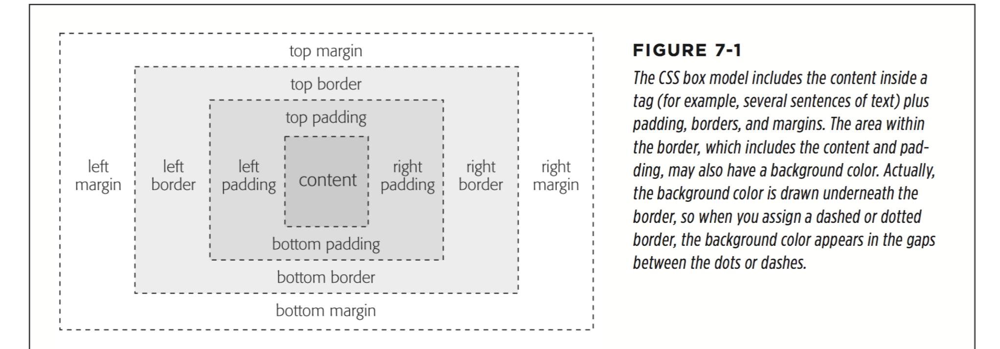
  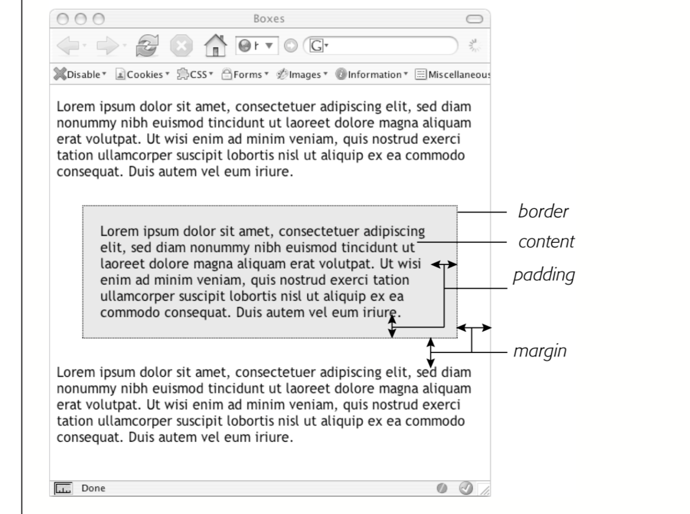

  * Controlling Space with Margins and Padding
    When you use percentages, web browsers calculate the amount of space based on the width of the containing element.
  ```
      margin-right: 20px;
      padding-top: 3em;
      margin-left: 10%;
  ```

  * Colliding Margins
  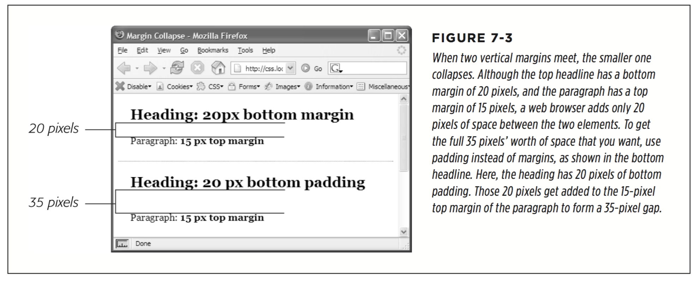

  * Removing Space with Negative Margins
Instead of adding space between a tag and elements around it, a negative margin removes space.

  * Inline, Block, and Other Display Settings
    * A block-level tag creates a break before and after it. The <p> tag, for example, creates a block that’s separated from tags above and below. Headlines, <div> tags, tables, lists, and list items are other examples of block-level tags.

    * Inline tags don’t create a break before or after them. They appear on the same line as the content and tags beside them.

  When it comes to margins and padding, browsers treat inline boxes di erently. Al- though you can add space to the left or right of an inline element using either left or right padding or left or right margins, you can’t increase the height of the inline element with top or bottom padding or margins.

  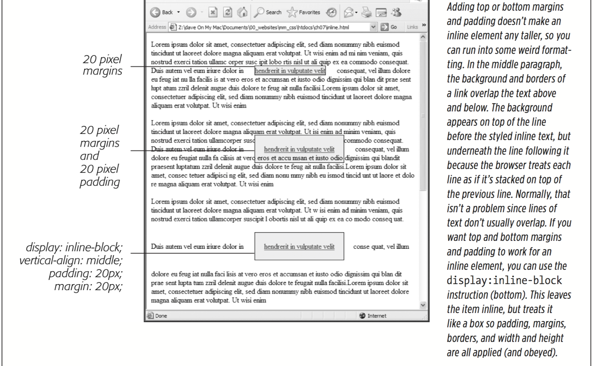

  Fortunately, CSS includes a property that lets you do just that—the display property. With it, you can make a block-level element act like an inline element:
       `display: inline;`

  Or you can make an inline element, like an image or link, behave like a block-level element:
       `display: block;`

  Finally, you can make an element act both like a block and an inline element. The inline-block setting makes an element sit on the same line as tags on either side of it, but also makes the element obey top and bottom margin and padding settings as well as height settings:
       `display: inline-block;`

  Another value, none, works in most browsers and has many uses. It does one simple thing—completely hides the styled element so it doesn’t appear in a web browser. With a dab of JavaScript programming, you can make an element hidden in this way instantly become visible, simply by changing its display back to either inline or block. You can even make an element with a display of none suddenly appear using CSS.

* Adding Borders
```
border: 4px solid rgb(255,0,0);

border-top: 2px solid black;
border-left: 2px solid black;
border-right: 2px solid black;
border-bottom: 4px dashed #333;

border: 2px inset #FFCC33;
border-right: none;

border-width: 2px;
border-style: double;
border-color: #FFCC33;
```
  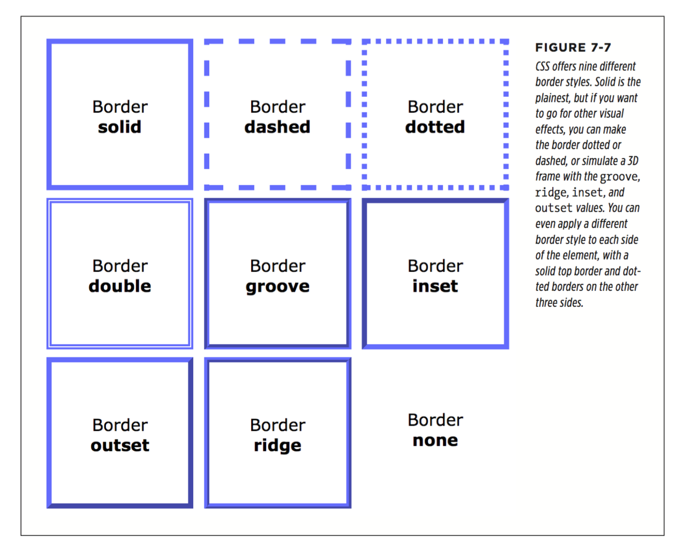

* Coloring the Background
```
  body {
    background-color: rgb(247,226,155);
  }
  .special-div {
    background-color: rgba(255,255,255,.75);
  }
```

* Creating Rounded Corners
```
 .specialBox {
    background-color: red;
    border-radius: 20px;
  }

 border-radius: 0 30px 10px 5px;
 border-radius: 1em 2em 1.5em .75em;

 border-top-left-radius: 1em;
  border-top-right-radius: 2em;
  border-bottom-right-radius: 1.5em;
  border-bottom-left-radius: .75em;
```
In addition to the perfectly round (that is, circular) corners you’ve seen so far, it’s also possible to apply an elliptical corner. The 40px value is the horizontal radius; the 20px value is the vertical radius.
```
 border-radius: 40px/20px ;

 border-radius: 40px 10px 20px 10px / 20px 30px 40px 20px;
```

* Adding Drop Shadows

The box-shadow property includes two optional values: inset and a spread value. The inset keyword tells a browser to draw the shadow inside the box (Figure 7-10, bottom). Simply add inset as the first value of the box-shadow property to create an inset shadow

You can also add a spread as a fourth value (between the shadow radius and shadow color). The spread expands the shadow by the specified amount. In other words, if you add a spread value of 10px, a browser expands the shadow 10 pixels in each direction (basically making it 20 pixels wider and 20 pixels taller). The value also dictates when the blur radius is applied;

  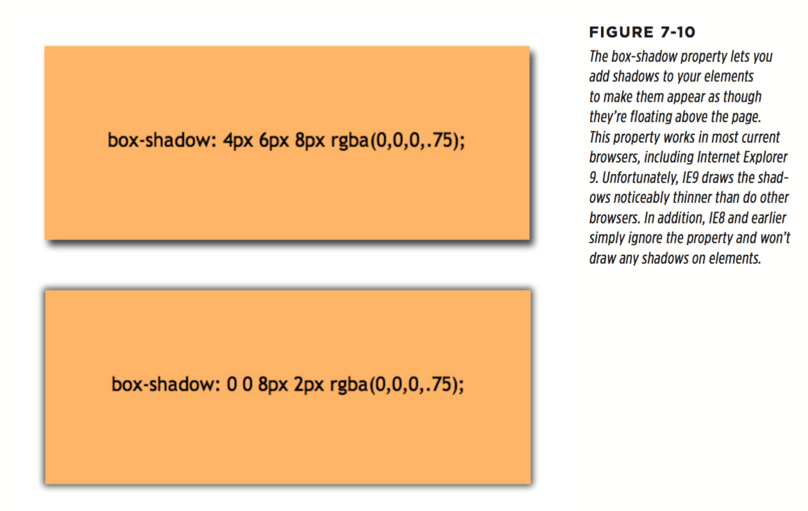
  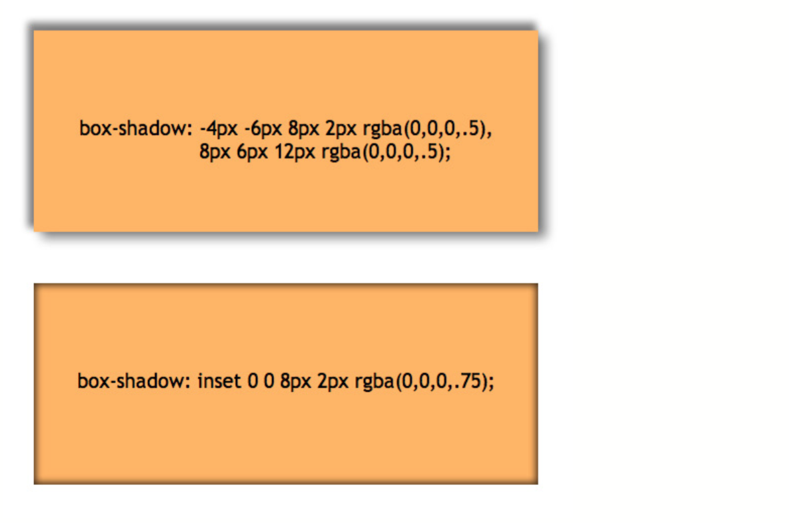
  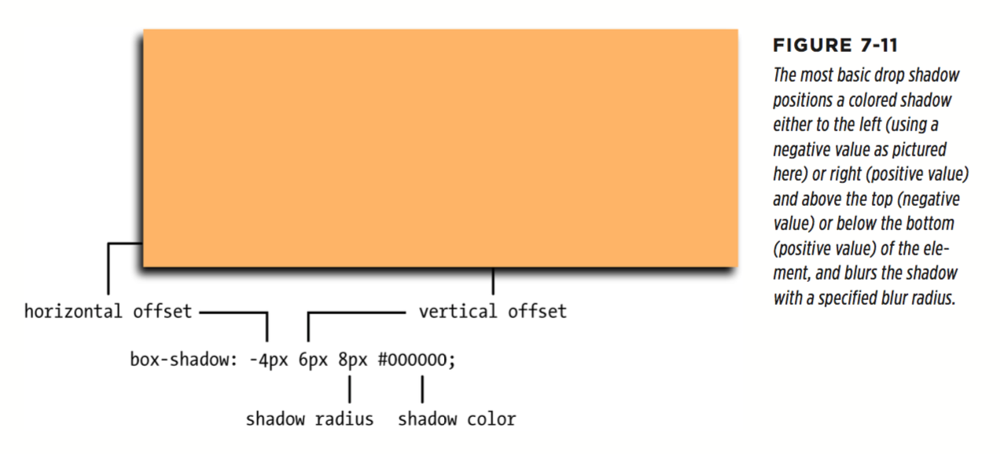

* Determining Height and Width
    ```
    width: 300px;
    width: 30%;
    height: 20em;
    ```
    * Calculating a Box’s Actual Width and Height
    Say you’ve set the following properties:
    ```
    width: 100px;
    padding: 15px;
    border-width: 5px;
    margin: 10px;
    ```
    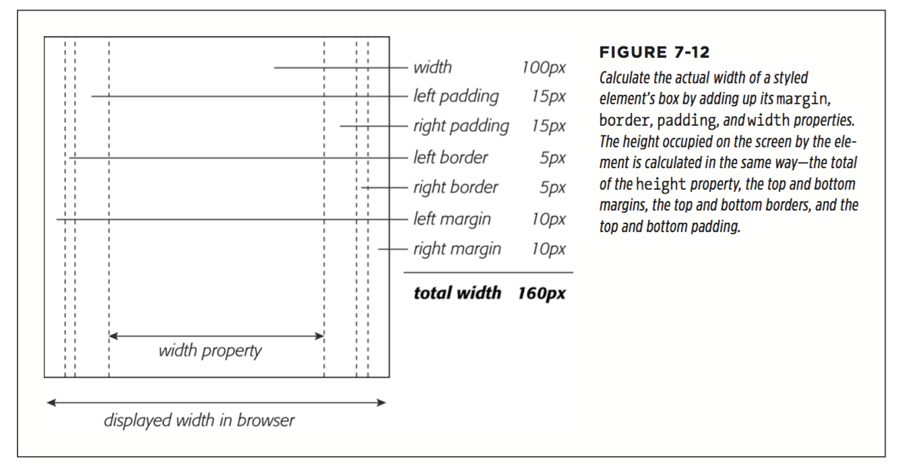

    The general rule of thumb for setting heights on page elements is don’t!
    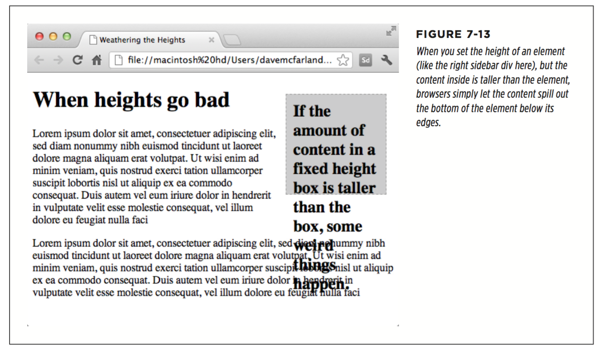

    The height property is useful for controlling the height of a div containing images, for example, because you can correctly determine the height of the images; how- ever, if you use the height for elements that have text, make sure to not only test your pages in the major browsers, but also test the page with different font sizes by increasing the font size in the web browser.

    * Redefining Box Width with Box-Sizing

    When using percentages with multiple columns, you can run into some weird problems. Say you have two columns (really, two tags, such as <div> tags), and you want each to be 50 percent of the width of the window. So you set the two columns to a width of 50%; however, the moment you add padding or a border to one of the columns, you’ll increase its width to more than 50% (to be exact, it will be 50% plus the amount of left and right padding and the width of the left and right borders). In most cases, this will force the second column to drop below the first.

    Fortunately, CSS o ers a property that lets you change how a browser calculates the screen width (and height) of an element. The box-sizing property provides three options:
    ```
      box-sizing: content-box;
      box-sizing: padding-box;
      box-sizing: border-box;

      *{
        box-sizing: border-box;
      }
    ```

    * Controlling the Tap with the Overflow Property
    ```
      overflow: visible
      overflow: scroll
      overflow: auto
      overflow: hidden
    ```

    * Maximum and Minimum Heights and Widths
      * The max-width property,not surprisingly,sets the maximum width for an element. That element can be thinner than the setting, but it can’t be any wider than that setting. This option comes in handy when you want your page to resize to fit different display widths, but you don’t want the page to get so wide that it’s too hard to read on a really large monitor. For example, say you add this style to a page:
      ```
        body {
          max-width: 1200px;
        }
      ```
       * The max-height property works much like max-width,except it’s for the element’s height. As mentioned on page 206, however, it’s usually best not to mess with the height of an element.
       * min-width
       * min-height

* Wrapping Content with Floating Elements

  HTML normally flows from the top of the browser window down to the bottom, one headline, paragraph, or block-level element on top of another.
  The float property moves an element to either the left or right. In the process, con- tent below the floated element moves up and wraps around the float.

  * left. Slides the styled element to the left while content below wraps around the right side of the element.
  * right. Slides the element to the right.
  * none

  Floated elements move to the left or right edge of their containing element. In some cases, this just means that the element moves to the left or right edge of the browser window. However, if you float an element that’s inside another tag with a set width or position on a web page, then the float will go to the left or right edge of that tag—the floated element’s “container.”

  You can even use the float property with an inline element, such as the  tag. In fact, floating a photo to the left or right using CSS is a very common use of the float property. A web browser treats a floated inline element just like a block-level element, so you don’t run into the problems with padding and margin that normally trouble inline elements.

  You can also float a block-level element like a headline or paragraph. A common technique is to float a <div> tag (or one of the HTML5 elements like <article>, <section>, or <aside>) containing other HTML tags and page content to create a kind of containing box. In this way, you can create sidebars, pull quotes, and other self-contained page elements. (You’ll see an example of this in this chapter’s tuto- rial.) When you float block-level elements, you should also set the width property for that element (in fact, CSS rules require setting the width for floated elements for all tags except images). This way, you can control how much horizontal space the block takes up and how much space is available for the content below it to move up and wrap around the block.

  * Backgrounds, Borders, and Floats
  To the frustration of many web designers, backgrounds and borders don’t react to floated elements the same way content does. Say you float an element—a sidebar for example—to the right. The content below the sidebar moves up and wraps around it, just as it should. But if that content has a background or border set on it, then that background or border actually appears underneath the floated sidebar (Figure 7-16, left). In essence, a web browser wraps the text around the float, but not the border or background. Believe it or not, this is absolutely kosher and (according to the rules) how it’s supposed to work. Of course, you may not want to follow these rules; you might want to have the border or background stop when it reaches the floated element (Figure 7-16, right). With a little CSS magic, you can do it.

  First, you need to add one rule to the style that has background or borders running underneath the float. Once you locate the style, add this line: overflow: hidden;. The overflow property (page 407) makes any background or border that extends underneath the float disappear.

  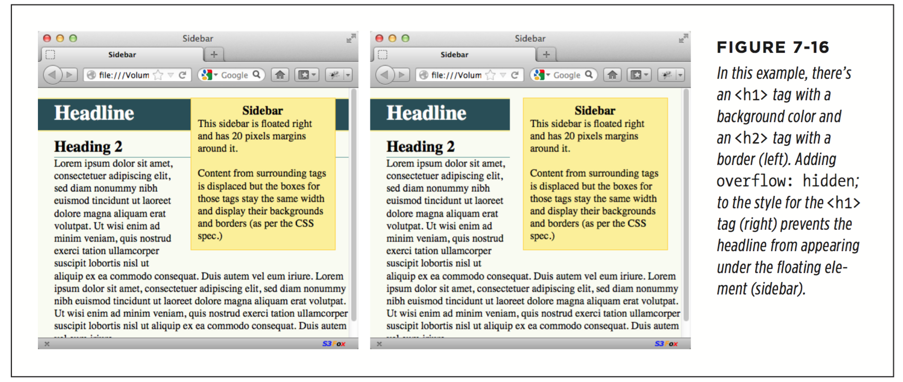

  * Stopping the Float
  Sometimes you need a way to tell a tag to ignore a floated element. For example, you may have a copyright notice that should always appear at the bottom of the browser window. If you have a particularly tall sidebar that’s floated to the left side of the page, the copyright notice might actually be drawn up the page and wrap around the float. Instead of appearing at the bottom of the page, the copyright is sitting farther up the page next to the sidebar. You want the copyright notice part of your page to refuse to wrap around the floated element and instead drop below it.

  Other problems occur when you have several floated items close together. If the floated items aren’t very wide, they float up and next to each other, and if they’re of varying heights they can get into an unattractive logjam (see Figure 7-17, top). In this case, the floated elements shouldn’t float next to each other. CSS provides the clear property for just these types of problems.

  The clear property instructs an element to not wrap around a floated item. By clearing an element, you essentially force it to drop down below the floated item. Also, you can control which type of float (left or right) is cleared or force a style to simply ignore both types of floats.

  The clear property accepts the following options:

  * left. The style will drop below elements that are floated left,but will still wrap around right-floated objects.
  * right. Forces a drop below right-floated objects, but still wraps around left- floated objects.
  * both. Forces a drop below both left- and right-floated elements.
  * none.Turns off clearing altogether.In other words,it makes an item wrap around both left- and right-floated objects, which is how web browsers normally work.

  In the case of a copyright notice that must appear at the bottom of the page, you’d want it to clear both left- and right-floated objects—it should always be below other content, and should never wrap to the left or right of any other item. Here’s a class style that would do just that:
  ```
    .copyright {
      clear: both;
    }
  ```

  Figure 7-17 shows how the clear property can prevent floated items of varying heights from clumping together. All three photos in that figure have a right float applied to them. In the top figure, the photo of the tomatoes (1) is the first image on the page and appears at the far right edge. The second image (2) obeys the float set on the first image and wraps up to the left of it. The last photo (3) is too wide to sit next to the second photo (2) but still tries to wrap around both (1) and (2). It gets stuck in the process.

  Using clear: right; on the images prevents the photos from sitting next to each other (Figure 7-17, bottom). The clear applied to the second photo prevents it from wrapping up next to the first image, while the last image’s right clear property forces it to appear below the second image.

  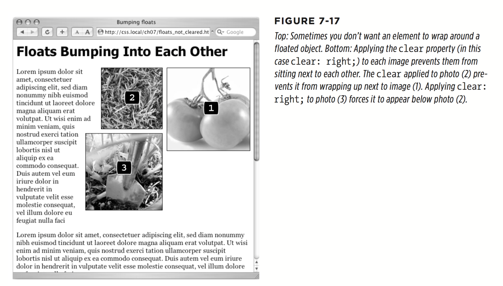
  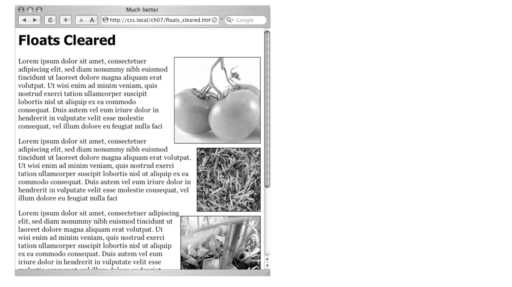
