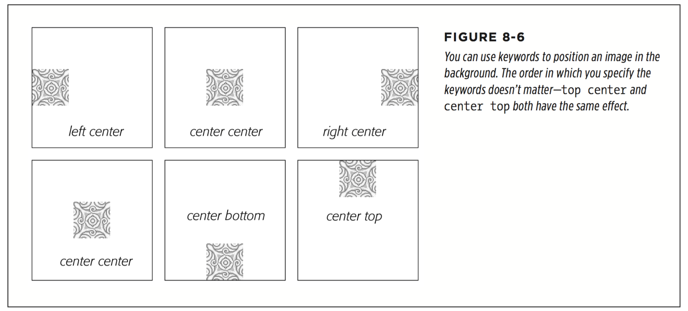
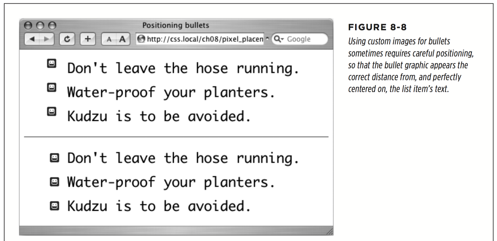
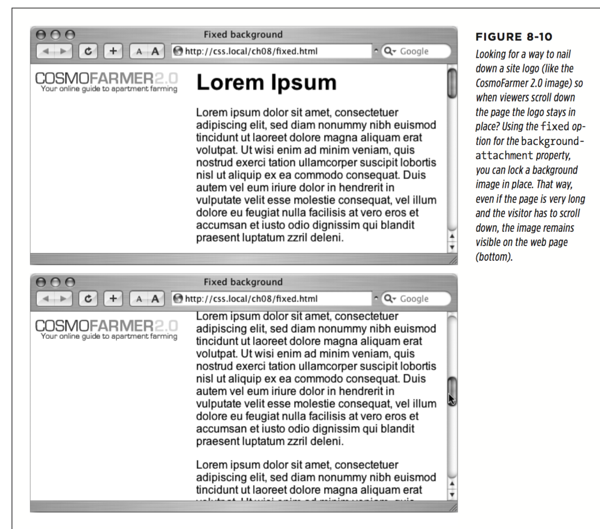
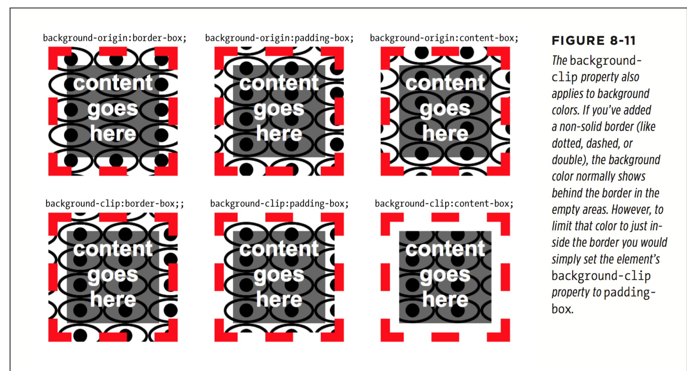
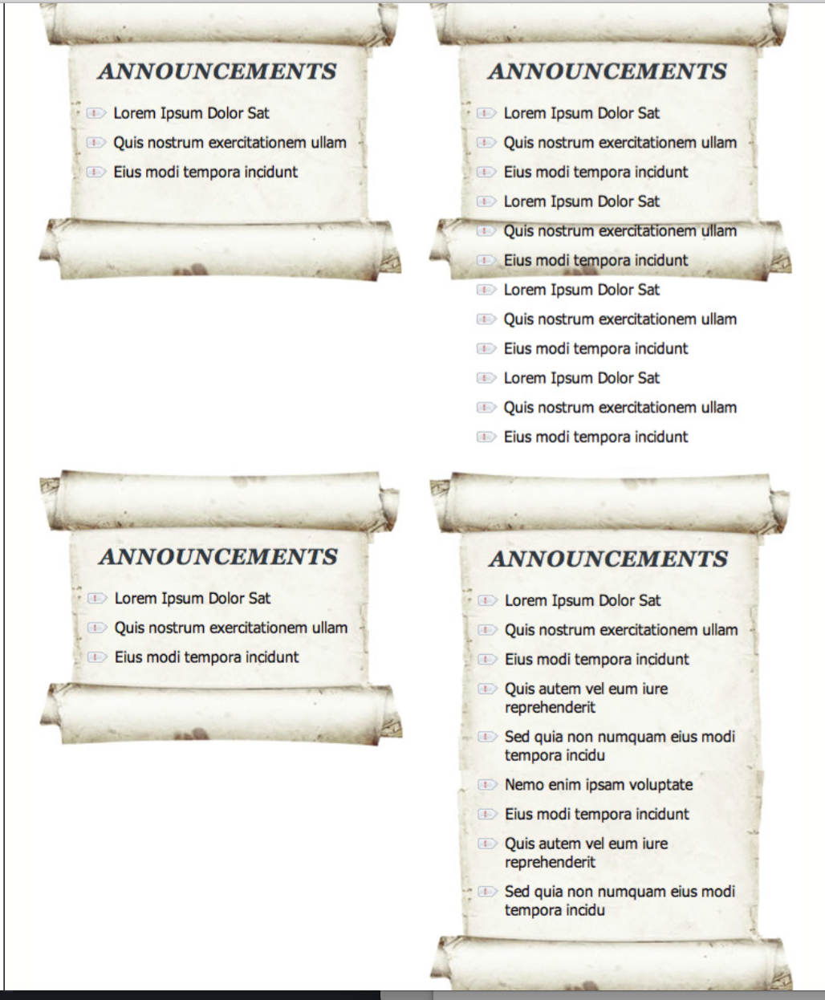
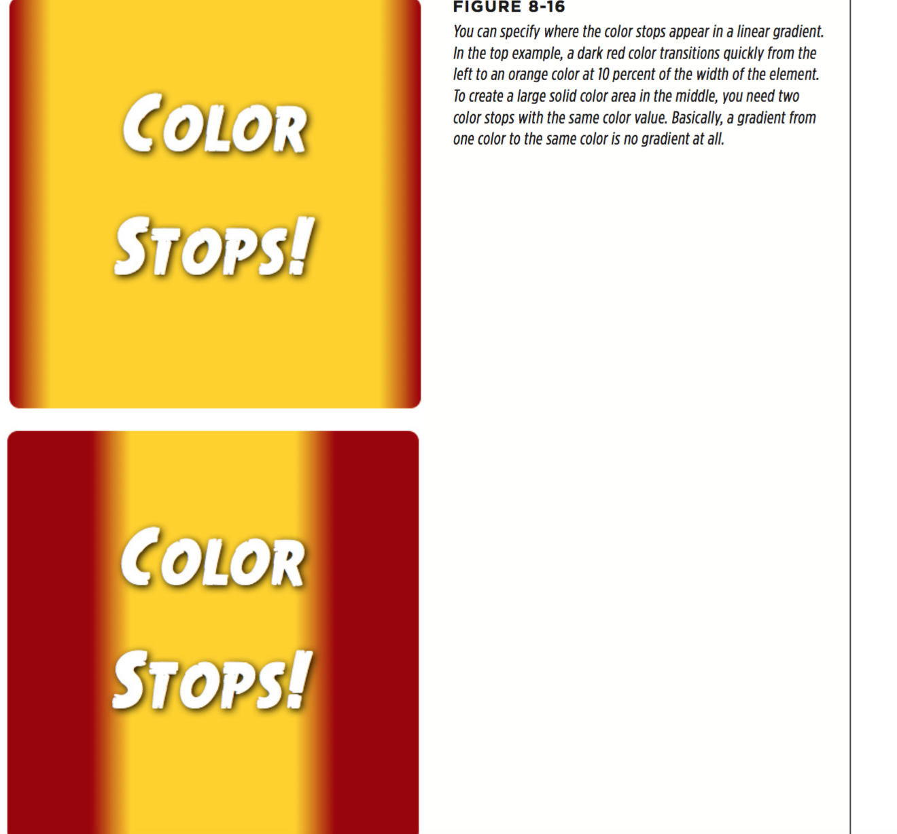
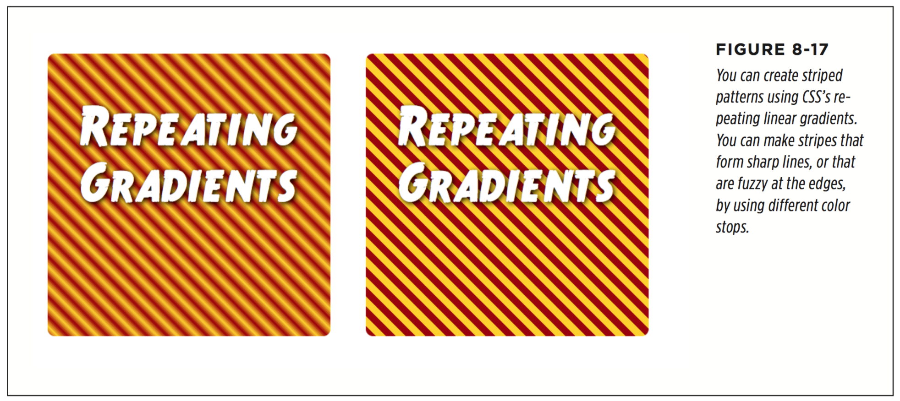
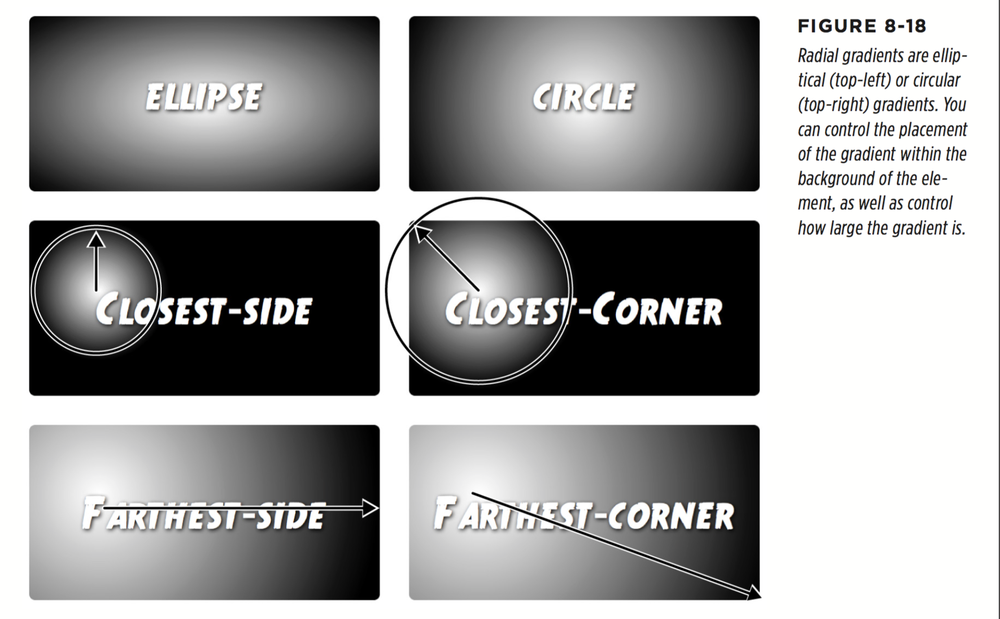

# chapter 8 : Adding Graphics to Web Pages

* Discovering CSS and the `` Tag
  * Borders
  * Padding
  * Float
  * Margin
  * Border-radius

* Adding Background Images
```
body {
  background-image: url(images/bg.png);
}
```
 You can use an absolute URL like this—url(http://www.cosmofarmer.com/image/bg.png)—or a document- or root-relative path like these:
 ```
   url(../images/bg.png) /* document-relative */
   url(/images/bg.png) /* root-relative */
 ```
* Controlling Repetition
`background-repeat: no-repeat;`
  * repeat (is the normal setting for background images that you want to display from left to right and top to bottom until the entire space is filled with a graphic)
  * no-repeat (displays the image a single time, without tiling or repetition.)
  * repeat-x (repeats an image horizontally along the x-axis,. It’s perfect for adding a graphical banner to the top of a web page or a decorative border along the top or bottom of a headline.)
  * repeat-y (repeats an image vertically along the y-axis)
  * round (tiles an image like the repeat option, but it never clips the image. The images are scaled to fit side by side and row upon row with no clipping (see left image in Figure 8-5). Browsers will distort the image copies to make this happen, so the aspect ratio of the graphic is not preserved.)
  * space (tiles an image like the repeat option,but it prevents the image from ever being clipped at the top or bottom. In other words, the space option always displays an image in its entirety. Accordingly, the browser will introduce space between the tiled copies of the image)


* Positioning a Background Image
  * Keywords
    You get two sets of keywords to work with. The first one controls the three hori- zontal positions—left, center, right—and the second controls the three vertical positions—top, center, bottom (Figure 8-6). Suppose you want to place a graphic directly in the middle of a web page. You can create a style like this:
    ```
    body {
      background-image: url(bg_page.jpg);
      background-repeat: no-repeat;
      background-position: center center;
    }
    ```
    

    Keywords are really useful when you want to create vertical or horizontal banners. If you wanted a graphic that’s centered on a page and tiled downwards in order to create a backdrop for content (Figure 8-7, left), then you’d create a style like this:
    ```
     body {
      background-image: url(background.jpg);
      background-repeat: repeat-y;
      background-position: center top;
    }
    ```

    * Precise Values

    You can also position background images by using pixel values or ems. You use two values: one to indicate the distance between the image’s left edge and the container’s left edge, and another to specify the distance between the image’s top edge and the style’s top edge. (Put another way, the first value controls the horizontal position, and the second value controls the vertical position.)

    Say you want custom bullets for a list. If you add a background image to the `<li>` tag, the bullets often don’t line up exactly (see Figure 8-8, top). So you can just nudge the bullets into place by using the background-position property. If the list would look better with, say, the bullets 5 pixels farther to the right and 8 pixels farther down, then add this declaration to the style defining the background image:
    ` background-position: 5px 8px;`
    

    * Percentage Values (probably not a good choice)

    * Fixing an Image in Place

      Normally, if there’s a background image on a web page and the visitor has to scroll down to see more of the page, the background image scrolls as well. As a result, any pattern in the background of the page appears to move along with the text. Furthermore, when you have a nonrepeating image in the background, it can po- tentially scroll o  the top of the page out of view. If you’ve placed the site’s logo or a watermark graphic in the background of the page, then you may not want it to disappear when visitors scroll.

      The CSS solution to such dilemmas is the background-attachment property. It has two options—scroll and fixed. Scroll is the normal web browser behavior; that is, it scrolls the background image along with the text and other page content. Fixed, however, keeps the image in place in the background (see Figure 8-10). So if you want to place your company’s logo in the upper-left corner of the web page, and keep it there even if the viewer scrolls, then you can create a style like this:
      ```
        body {
          background-image: url(images/logo.gif);
          background-repeat: no-repeat;
          background-attachment: fixed;
        }
      ```

      The fixed option is also very nice when using a repeating, tiled background. When you have to scroll, the page’s text disappears o  the top, but the background doesn’t move: The page content appears to float gracefully above the background.

      

* Defining the Origin and Clipping for a Background

CSS includes the ability to tell a browser where the background image should begin in relation to the border, padding, and content of an element. For example, normally when you tile an image, it starts in the upper-left corner of the padding of an element (see the top, middle image in Figure 8-11). However, you can reposition that image’s starting point, using the background-origin property. It takes one of three values:



* Scaling Background Images
  * `background-size: 100px 200px;`
  * `background-size: 100px auto;`
  * `background-size: 100% 100%;`
  * `background-size: contain;`
  * `background-size: cover;`


* Using Background Property Shorthand
Any property value you leave out simply reverts to its normal behavior, so say you specify only an image:
    `background: url(image/bullseye.gif);`
That’s the equivalent of this:
```
    background: url(image/bullseye.gif) left top / 100% repeat scroll border-box
    border-box transparent;
```

* Free Images
  * http://foter.com/
  * https://unsplash.com
  * www.morguefile.com
  * www.freeimages.com
  * http://openphoto.net
  * http://search.creativecommons.org.
  * www.flickr.com/creativecommons)

* Using Multiple Background Images
```
background-image: url(scrollTop.jpg),
                  url(scrollBottom.jpg),
                  url(scrollMiddle.jpg);

background-repeat: no-repeat,
                   no-repeat,
                   repeat-y;

background: url(scrollTop.jpg) center top no-repeat,
            url(scrollBottom.jpg) center bottom no-repeat,
            url(scrollMiddle.jpg) center top repeat-y;
```       
           

* Utilizing Gradient Backgrounds
  * Linear Gradients
  ```
  background-image: linear-gradient(to right, black, white);
  background-image: linear-gradient(to bottom, black, white);
  background-image: linear-gradient(to bottom right, orange, red);

  background-image: linear-gradient(to top, black, white);
  background-image: linear-gradient(0deg, black, white);

  background-image: linear-gradient(135deg, rgb(0,0,0), rgb(204,204,204));
  ```

  * COLOR STOPS
  ```
  background-image: linear-gradient(to right, black, white, black);
  background-image: linear-gradient(to right, black, rgb(255,255,255), #FFFFFF, HSL(0,0%,0%));
  ```
  (分别为下图上下)
  Notice that the 10% applies to the second color (the orange): This tells the browser that it needs to get to this color at 10 percent of the width of the element. Likewise, the 90% indicates that the browser needs to stay at that orange color until it’s 90 percent across the element, and then begin the transition to the deep red at the far right of the element.
  ```
  background-image: linear-gradient(to right, #900, #FC0 10%, #FC0 90%, #900);
  ```

  You don’t need to use any values for the first or last color, since the browser as- sumes that the first color starts at 0% and the last color ends at 100%. However, if you wanted to keep a solid starting color further into the element, you could provide a value after the first color. For example, the bottom image in Figure 8-16 is created with this declaration:

  Notice that the first color—#900—also has a position of 20%. This means that the first 20 percent of the element (from left to right) should be a solid red color. Then, at the 20 percent point, the gradient should begin transitioning to the orange color at 30 percent.
  ```
  background-image: linear-gradient(to right, #900 20%, #FC0 30%, #FC0 70%, #900 80%);
  ```


  * Repeating Linear Gradients

  Normally, a linear gradient fills the entire element with the first color at one point and the last color at the opposite edge of the element. However, it’s possible to create repeating gradients so you can create gradient patterns. In essence, you define a gradient with specified color stops; the browser draws the gradient, and then repeats that pattern, tiling it in the background of the element. For example, to get the repeating gradient of the left image in Figure 8-17 you can write this code:

  `background-image: repeating-linear-gradient(45deg, #900 20px, #FC0 30px, #900 40px)`

  In cases like this, using pixel values for the color stops is very useful. In essence, the browser draws a gradient that starts at bottom-left; it starts with 20 pixels of deep red, then transitions to an orange at 30 pixels, and then goes back to deep red at 40 pixels. Once it’s drawn that gradient, the browser simply tiles it in the background like a tiled image.

  You can even use repeating gradients to create solid stripes without any of the fancy and subtle transitions between colors. For example, the image on the right in Figure 8-16 is created with this declaration:

  `background-image: repeating-linear-gradient(45deg, #900 0, #900 10px, #FC0 10px, #FC0 20px);`

  Here, you start with deep red (#900) at the 0 point, and go to red again at the 10px point. Since you’re transitioning between the same colors, the browser draws this as a solid color. Next, you transition to orange (#FC0) at 10 pixels. Since that’s the same spot at which the red ends, that’s not a subtle transition; the pattern just goes from red to orange. Finally, the transition goes to the same orange at 20 pixels, creating another solid line. Because this is a repeating linear gradient, the browser simply tiles that pattern to fill the background of the element.

  

  * Radial Gradients

  CSS also provides a way of creating radial gradients—gradients that radiate outward in a circular or elliptical pattern (see Figure 8-18). The syntax is similar to linear gradients and at its most simple, you need only to provide a beginning color (the color at the middle of the gradient) and an ending color (the color at the end of the gradient). For example, the top-left image in Figure 8-18 is created with this code:
  ```
    background-image: radial-gradient(red, blue); (default to elliptical, center of the element)
    background-image: radial-gradient(circle, red, blue); (circle, center of the element)
    background-image: radial-gradient(circle at 20% 40%, red, blue); (circle, 20% over left edge, 40% over top edge)

    background-image: radial-gradient(closest-side circle at 20% 40%, red, blue);
    background-image: radial-gradient(closest-corner circle at 20% 40%, red, blue);
    background-image:  radial-gradient(farthest-side circle at 20% 40%, red, blue);
    background-image:  radial-gradient(farthest-corner circle at 20% 40%, red, blue);
  ```
  

  As with linear gradients, you can use multiple color stops and set the placement of those color stops. For example, say you want a circular gradient that was composed of a bright red, an orange, and a yellow. You want the red to appear for a while before it transitions to orange, and then the orange lasts a while longer until the yellow ap- pears at the end. You can use percentage values to dictate where the colors appear:

  `background-image: radial-gradient(circle at 20% 40%, red 20%, orange 80%, yellow);`

  * Repeating Radial Gradients
  
  As with linear gradients, you can create radial gradients that repeat—perfect for that bull’s eye look, or when you wish to hypnotize your website visitors. You need to make sure you add either percentages or actual pixel or em values for the various color stops so the browser knows the size of a single radial gradient and can then repeat it. For example:

  `background-image: repeating-radial-gradient(circle, red 20px, orange 30px, yellow 40px, red 50px);`
