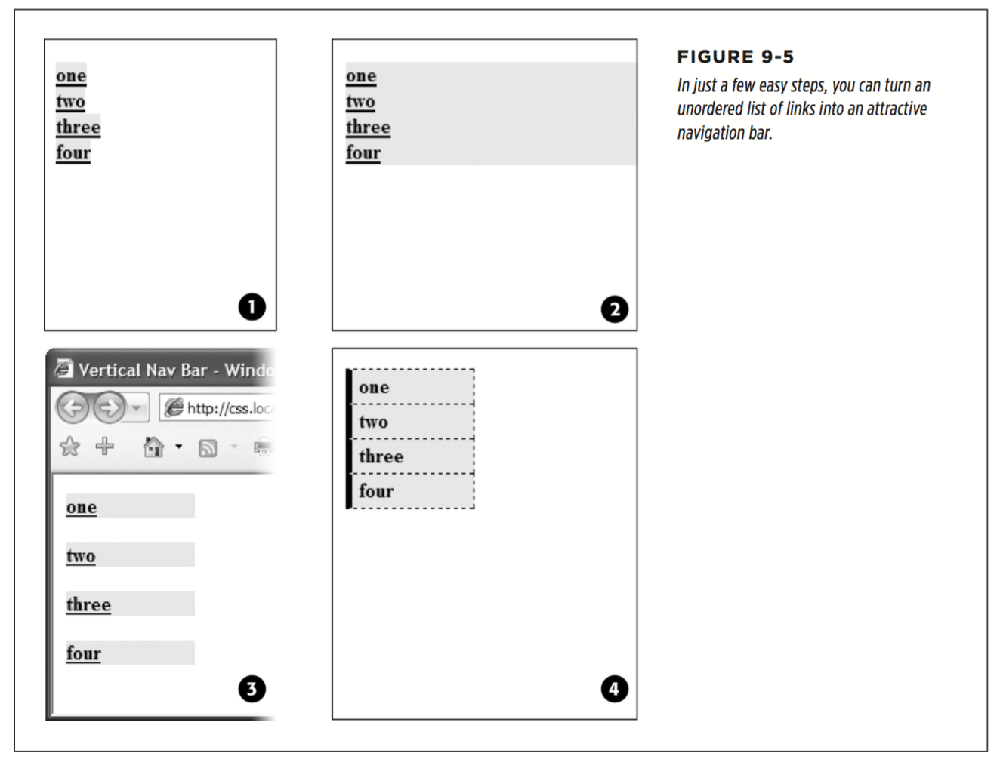
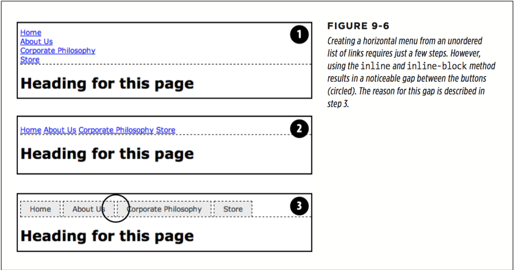
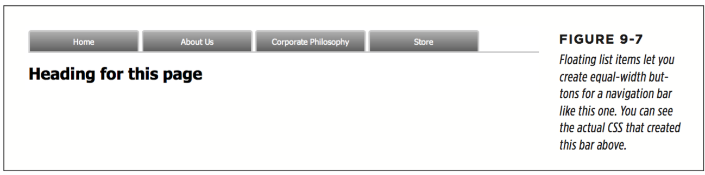

# chapter 9 : Sprucing Up Your Site’s Navigation

* Selecting Which Links to Style
  * Understanding Link States
  ```
    :link
    :visited
    :hover
    :active

    a:link { color: #F60; }
    a:visited { color: #900; }
    a:hover { color: #F33; }
    a:active {color: #B2F511; }
  ```
  If you change the order, the hover and active states won’t work. For example, if you put a:hover before a:link and a:visited, then the color change won’t take e ect when hovering.

  * Targeting Particular Links
  ```
    .sponsor { font-family: Arial, sans-serif; }
    .sponsor:link { color: #F60; }
    .sponsor:visited { color: #900; }
    .sponsor:hover { color: #F33; }
    .sponsor:active {color: #B2F511; }
  ```

  * Grouping links with descendant selectors
  ```
    nav a { font-family: Arial, sans-serif; }
    nav a:link { color: #F60; }
    nav a:visited { color: #900; }
    nav a:hover { color: #F33; }
    nav a:active {color: #B2F511; }

    .mainNav a { font-family: Arial, sans-serif; }
    .mainNav a:link { color: #F60; }
    .mainNav a:visited { color: #900; }
    .mainNav a:hover { color: #F33; }
    .mainNav a:active {color: #B2F511; }
  ```

* Styling Links
  * Underlining Links
    * Remove the underline entirely `a {text-decoration: none;}`
    * Underline when mousing over
    ```
    a{
      text-decoration: none;
      background-color: #F00;
    }
    a:hover {
      background-color: transparent;
      text-decoration: underline;
    }
    ```
    * Use a bottom border
    ```
    a{
      text-decoration: none; border-bottom: dashed 2px #9F3;
    }
    ```
    * Use a background image
    ```
    a{
      text-decoration: none;
      background: url(images/underline.gif) repeat-x left bottom; padding-bottom: 5px;
    }
    ```
  * Creating a Button
  ```
    <a href="stale. html" class="button">Free Donuts Here!</a>

    a.button {
      border: solid 1px rgb(0,0,0);
    }

     a.button {
      border: solid 1px rgb(0,0,0);
      background-color: rgb(51,51,51);
    }

    a.button {
      background: #B1B1B1;
      color: #FFF;
      font-weight: bold;
      border-width: 4px;
      border-style: solid;
      border-top-color: #DFDFDF;
      border-right-color: #666;
      border-bottom-color: #333;
      border-left-color: #858585;
    }

    a.button {
      background-color: #ee432e;
      background-image: -webkit-linear-gradient(top, #ee432e 0%, #c63929 50%, #b51700 50%, #891100 100%);
      background-image: -moz-linear-gradient(top, #ee432e 0%, #c63929 50%, #b51700 50%, #891100 100%);
      background-image: -o-linear-gradient(top, #ee432e 0%, #c63929 50%, #b51700 50%, #891100 100%);
      background-image: linear-gradient(top, #ee432e 0%, #c63929 50%, #b51700 50%, #891100 100%);
      border: 1px solid #951100;
      border-radius: 5px;
      box-shadow: inset 0px 0px 0px 1px rgba(255, 115, 100, 0.4), 0 1px 3px #333333;
      padding: 12px 20px 14px 20px;
      text-decoration: none;
      color: #fff;
      font: bold 20px/1 "helvetica neue", helvetica, arial, sans-serif;
      text-align: center;
      text-shadow: 0px -1px 1px rgba(0, 0, 0, 0.8);
    }
  ```
  * Using Graphics
   * Don’t forget no-repeat
   * Control placement with background-position
   * Padding gives you room
   * Use the pseudo-classes

* Building Navigation Bars
 * Using Unordered Lists
  ```
     <ul class="nav">
      <li><a href="index.html">Home</a></li>
      <li><a href="news.html">News</a></li>
      <li><a href="reviews.html">Reviews</a></li>
    </ul>
  ```
    * Remove the bullets
    * Eliminate padding and margins
    ```
      ul.nav {
        list-style-type: none;
        padding-left: 0;
        margin-left: 0;
      }
    ```
  These two steps essentially make each list item look like any plain old block-level element, such as a paragraph or headline (except that a browser doesn’t insert mar- gins between list items).

  * Vertical Navigation Bars
    * Display the link as a block
    Since the `<a>` tag is an inline element, it’s only as wide as the content inside it. Buttons with different length text (like Home and Our Products) are different widths. The staggered appearance of different width buttons stacked on top of each other doesn’t look good, as you can see in `#1` in Figure 9-5. In addition, top and bottom padding and margins have no e ect on inline elements. To get around these limitations, style the link as a block element:
    ```
      ul.nav a {
        display: block;
      }       
    ```
    * Constrain the width of the buttons
    Making links block-level elements also means they’re as wide as the tag they’re nested in. So when they’re just sitting in a page, those links stretch the width of the browser window (`#2` in Figure 9-5). You have several ways to make them a little narrower. First you can just set the width of the `<a>` tag. If you want each button to be 8 ems wide, for example, then add that to the width property:
    ```
      ul.nav a {
        display: block; width: 8em;
      }
    ```

    Setting a width for any of the tags that wrap around those links—such as the <li> or <ul> tags—also works.
    If the button text occupies only one line, you can also center the text vertically so there’s equal space above and below the link text. Just add a height to the link and set its line-height property to the same value:
    ```
      a{
        height: 1.25em;
        line-height: 1.25em;
      }
    ```
    

  * Horizontal Navigation Bars
    * USING DISPLAY: INLINE AND DISPLAY: INLINE-BLOCK
      * Create a style for the unordered list to remove any padding, margins, and bullets
      ```
        ul.nav {
          margin-left: 0px;
          padding-left: 0px;
          list-style: none;
          border-bottom: 1px dashed #000;
        }
      ```
      In this case, you’ve also added a bottom border, which will appear under the buttons (see `#1` in Figure 9-6).
      * Make the list items inline elements
      `.nav li { display: inline; }`
      * Style the links
      You can remove the underline beneath the links and add a border around them instead. You can also add background color or a background image to provide visual depth. Add padding if you need more room around each link’s text. If you want some space between each button, then apply a right margin. The following style gives links a button-like appearance, as shown in `#3` in Figure 9-6:
      ```
        .nav a {
          display: inline-block;
          border: 1px dashed #000;
          border-bottom: none;
          padding: 5px 15px 5px 15px;
          background-color: #EAEAEA;
          text-decoration: none;
          color: #333;
        }
      ```
      First, you need to set the display property of the links to inline-block. This makes sure that top and bottom padding and margins are obeyed (as described on page 192, normally inline elements ignore top and bottom padding and margins as well as width and height values). Then you can style the buttons to your heart’s content. Here, you’ve added a border to the links and removed the bottom border so it doesn’t double up on the bottom border applied to the unordered list.

      To make this horizontal nav bar appear in the center of the page, add text-align: center; to the <ul> tag’s style. In fact, this is one benefit of this technique over the float technique described next—when you use inline and inline-block, you can center your nav bar, which you can’t do with floats.

      You will, however, notice that the buttons don’t touch (see the circled area in Figure 9-6). That has to do with the way web browsers treat the white space between the <li> tags. Web browsers treat any white space (a tab, carriage return, or space character) between a closing </li> and the next <li> as a space. There are a couple of ways to remove this space:
        * Put the closing </li> and opening <li> on the same line
        * Add a negative right margin to the list items.
        ```
          .nav li {
            display: inline;
            margin-right: -5px;
          }
        ```
        

  * USING FLOATS FOR HORIZONTAL NAVIGATION
    * Float the list items `.nav li { float: left; }`
    * Add display: block to the links ` .nav a { display: block; }`

      Links are inline elements, so width values (as well as top and bottom padding and margins) don’t apply to them. Making a browser display the links as block elements lets you set an exact width for the button and add a comfortable amount of white space above and below each link:
    * Style the links
    * Add a width
    * Add overflow: hidden to the `<ul>` tag style
    ```
      .nav {
        overflow: hidden;
      }
    ```

    Here are the styles required to create the navigation bar pictured in Figure 9-7. Notice that the buttons are the same width, and the button text is centered.

    ```
    .nav {
      margin: 0px;
      padding: 0px;
      list-style: none;
      border-bottom: 3px solid rgb(204,204,204);
      overflow: hidden;
    }
    .nav li {
      float: left;
    }
    .nav a {
      width: 12em;
      display: block;
      border: 3px solid rgb(204,204,204);
      border-bottom: none;
      border-radius: 5px 5px 0 0;
      padding: 10px;
      margin-right: 5px;
      background-color: rgb(95,95,95);
      background-image: -webkit-linear-gradient(rgb(175,175,175), rgb(95,95,95));
      background-image: -moz-linear-gradient(rgb(175,175,175), rgb(95,95,95));
      background-image: -o-linear-gradient(rgb(175,175,175), rgb(95,95,95));
      background-image: linear-gradient(rgb(175,175,175), rgb(95,95,95));
      text-decoration:none;
      color: white;
      text-align: center;
      font-family: Arial, Helvetica, sans-serif;
      font-weight: bold;
    }
    ```
    

* Styling Particular Types of Links
  * Links to Other Websites
  ```
    a[href*='://']:not(a[href*='www.mysite.com']) {
      background: url(images/globe.png) no-repeat center right;
      padding-right: 15px;
    }
  ```
  * Email Links
  ```
    a[href^='mailto:']
  ```
  * Links to Specific Types of Files
  ```
    a[href$='.zip'] /* zip archive */
    a[href$='.doc'] /* Word document */
  ```
